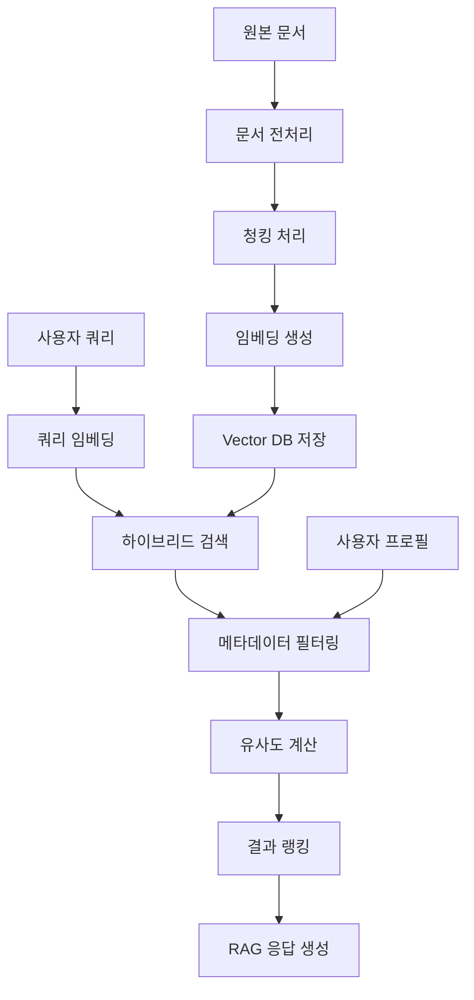
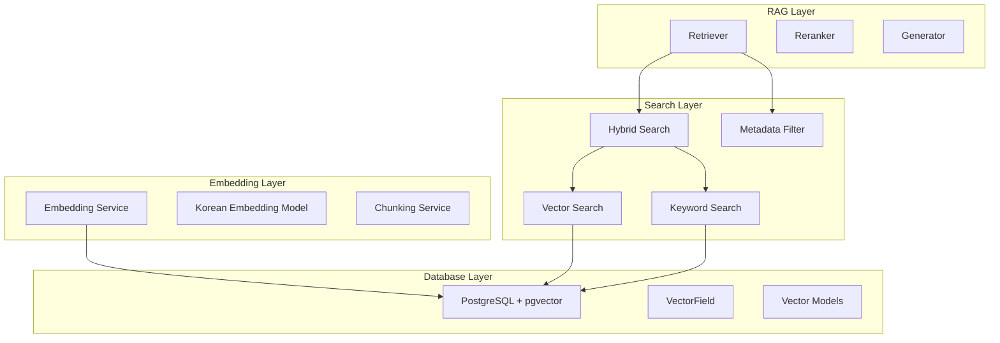
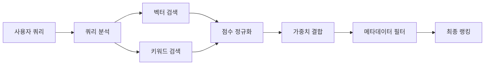

# RAG Vector Database System Implementation Plan

## 1. 시스템 개요

### 목표
- pgvector를 활용한 Vector Database 구축
- 한국어 약학/의학 정보에 최적화된 RAG 시스템 구현
- Tortoise ORM과 pgvector 통합
- 하이브리드 검색 (벡터 + 키워드) 지원

### 핵심 요구사항
1. 로컬 PostgreSQL + pgvector 사용
2. Tortoise ORM 기반 Vector 필드 구현
3. 처방전/약품 정보 한국어 임베딩 최적화
4. 메타데이터 필터링 및 하이브리드 검색
5. 사용자 프로필 기반 개인화 검색

## 2. 아키텍처 설계

### 2.1 데이터 플로우



### 2.2 시스템 컴포넌트



## 3. 구현 단계별 계획

### Phase 1: 기반 인프라 구축
1. **VectorField 구현**
   - Tortoise ORM 커스텀 필드 정의
   - pgvector 연산자 지원 (<=>, <->, <#>)
   - 벡터 정규화 및 인덱싱 지원

2. **Vector Models 정의**
   - PharmaceuticalDocument: 원본 문서
   - DocumentChunk: 청크 단위 저장
   - SearchQuery: 검색 로그
   - EmbeddingModel: 모델 메타데이터

### Phase 2: 임베딩 시스템 구축
1. **한국어 임베딩 모델 선택**
   - 후보: sentence-transformers/paraphrase-multilingual-MiniLM-L12-v2
   - 후보: jhgan/ko-sroberta-multitask
   - 후보: BM-K/KoSimCSE-roberta-multitask
   - 약학/의학 도메인 특화 평가 필요

2. **청킹 전략**
   - 구조화된 청킹: [효능,효과], [용법,용량], [주의사항] 기준
   - 의미적 청킹: 문장 경계 고려
   - 오버랩 청킹: 컨텍스트 보존

### Phase 3: 검색 시스템 구현
1. **Vector Search**
   - 코사인 유사도 기반 검색
   - HNSW 인덱스 최적화
   - 벡터 정규화 및 내적 활용

2. **Hybrid Search**
   - 벡터 검색 + 키워드 검색 결합
   - 가중치 기반 점수 계산
   - 메타데이터 필터링 통합

### Phase 4: RAG 시스템 완성
1. **Retriever 구현**
   - 다단계 검색 파이프라인
   - 사용자 프로필 기반 필터링
   - 결과 리랭킹

2. **Generator 최적화**
   - 프롬프트 엔지니어링
   - 응답 품질 제어
   - 안전성 검증

## 4. 데이터베이스 스키마 설계

### 4.1 핵심 테이블

```sql
-- 문서 테이블
CREATE TABLE pharmaceutical_documents (
    id SERIAL PRIMARY KEY,
    title VARCHAR(500) NOT NULL,
    document_type VARCHAR(50) NOT NULL,
    content TEXT NOT NULL,
    content_hash VARCHAR(64) UNIQUE NOT NULL,
    medicine_names JSONB DEFAULT '[]',
    target_conditions JSONB DEFAULT '[]',
    document_embedding vector(1536),
    created_at TIMESTAMP DEFAULT NOW(),
    updated_at TIMESTAMP DEFAULT NOW()
);

-- 청크 테이블
CREATE TABLE document_chunks (
    id SERIAL PRIMARY KEY,
    document_id INTEGER REFERENCES pharmaceutical_documents(id) ON DELETE CASCADE,
    chunk_index INTEGER NOT NULL,
    chunk_type VARCHAR(50) NOT NULL,
    content TEXT NOT NULL,
    content_hash VARCHAR(64) NOT NULL,
    section_title VARCHAR(200),
    keywords JSONB DEFAULT '[]',
    medicine_names JSONB DEFAULT '[]',
    target_conditions JSONB DEFAULT '[]',
    embedding vector(1536) NOT NULL,
    embedding_normalized BOOLEAN DEFAULT FALSE,
    created_at TIMESTAMP DEFAULT NOW(),
    UNIQUE(document_id, chunk_index)
);

-- HNSW 인덱스 생성
CREATE INDEX ON document_chunks USING hnsw (embedding vector_cosine_ops);
CREATE INDEX ON document_chunks USING gin (medicine_names);
CREATE INDEX ON document_chunks USING gin (keywords);
```

### 4.2 인덱싱 전략

1. **Vector 인덱스**: HNSW (Hierarchical Navigable Small World)
   - 코사인 유사도 최적화
   - 메모리 효율적 근사 검색

2. **JSON 인덱스**: GIN (Generalized Inverted Index)
   - 약품명, 키워드 배열 검색 최적화
   - 메타데이터 필터링 성능 향상

## 5. 임베딩 모델 평가 계획

### 5.1 평가 데이터셋
- 약품 정보 문서 100개
- 의학 용어 사전
- 처방전 샘플 데이터
- 사용자 질의 시나리오

### 5.2 평가 메트릭
- **의미적 유사도**: 약품명 유사 검색 정확도
- **도메인 특화성**: 의학 용어 이해도
- **다국어 지원**: 한국어-영어 혼재 텍스트 처리
- **성능**: 임베딩 생성 속도

### 5.3 후보 모델

| 모델 | 차원 | 언어 | 특징 |
|------|------|------|------|
| paraphrase-multilingual-MiniLM-L12-v2 | 384 | 다국어 | 경량, 빠른 속도 |
| jhgan/ko-sroberta-multitask | 768 | 한국어 | 한국어 특화 |
| BM-K/KoSimCSE-roberta-multitask | 768 | 한국어 | 문장 유사도 특화 |
| OpenAI text-embedding-3-small | 1536 | 다국어 | 고성능, API 기반 |

## 6. 하이브리드 검색 설계

### 6.1 검색 파이프라인



### 6.2 점수 계산 공식

```
final_score = α × vector_score + β × keyword_score + γ × metadata_score

where:
- α = 0.6 (벡터 유사도 가중치)
- β = 0.3 (키워드 매칭 가중치)
- γ = 0.1 (메타데이터 일치 가중치)
```

### 6.3 메타데이터 필터링

1. **사용자 조건 기반**
   - 임부, 수유부, 노인, 소아
   - 기저질환 (당뇨, 고혈압, 신장질환 등)
   - 알레르기 정보

2. **시간 기반**
   - 최신 정보 우선순위
   - 업데이트 날짜 고려

3. **약물 상호작용**
   - 복용 중인 약물과의 상호작용
   - 금기사항 확인

## 7. 성능 최적화 전략

### 7.1 벡터 검색 최적화
- **벡터 정규화**: L2 정규화로 내적 연산 활용
- **배치 처리**: 다중 쿼리 동시 처리
- **캐싱**: 자주 검색되는 벡터 결과 캐시

### 7.2 인덱스 최적화
- **HNSW 파라미터 튜닝**
  - m: 16 (연결 수)
  - ef_construction: 64 (구축 시 탐색 범위)
  - ef_search: 40 (검색 시 탐색 범위)

### 7.3 메모리 관리
- **벡터 압축**: PQ (Product Quantization) 고려
- **배치 로딩**: 대용량 문서 처리 시 메모리 효율화

## 8. 에러 처리 및 엣지 케이스

### 8.1 데이터 품질 이슈
- **중복 문서 처리**: content_hash 기반 중복 제거
- **불완전한 문서**: 최소 길이 검증
- **인코딩 오류**: UTF-8 정규화

### 8.2 검색 실패 케이스
- **빈 결과**: 유사도 임계값 동적 조정
- **성능 저하**: 타임아웃 및 폴백 전략
- **모델 오류**: 임베딩 생성 실패 시 키워드 검색으로 폴백

### 8.3 확장성 고려사항
- **샤딩**: 문서 타입별 테이블 분할
- **읽기 복제본**: 검색 성능 향상
- **비동기 처리**: 임베딩 생성 큐 시스템

## 9. 테스트 전략

### 9.1 단위 테스트
- VectorField 직렬화/역직렬화
- 유사도 계산 정확성
- 메타데이터 필터링 로직

### 9.2 통합 테스트
- 전체 검색 파이프라인
- 데이터베이스 연동
- 성능 벤치마크

### 9.3 사용자 테스트
- 실제 약학 질의 시나리오
- 검색 결과 품질 평가
- 응답 시간 측정

## 10. 배포 및 모니터링

### 10.1 배포 전략
- **단계적 배포**: 기존 시스템과 병렬 운영
- **A/B 테스트**: 검색 품질 비교
- **롤백 계획**: 문제 발생 시 즉시 복구

### 10.2 모니터링 지표
- **검색 성능**: 평균 응답 시간, 처리량
- **검색 품질**: 클릭률, 만족도 점수
- **시스템 리소스**: CPU, 메모리, 디스크 사용량

---

## 다음 단계

이 계획서를 검토해주시고, **`go`** 명령을 주시면 구현을 시작하겠습니다.

특히 다음 사항들에 대한 피드백을 부탁드립니다:
1. 임베딩 모델 선택 방향성
2. 하이브리드 검색 가중치 설정
3. 메타데이터 필터링 우선순위
4. 성능 목표 수치 (응답시간, 처리량 등)
