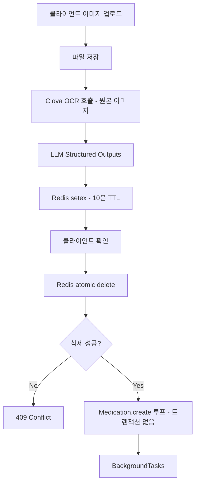
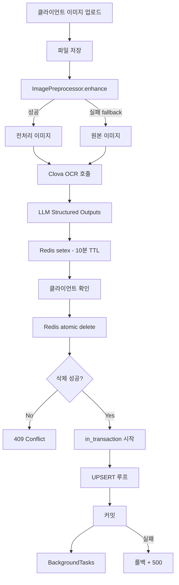
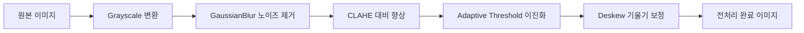
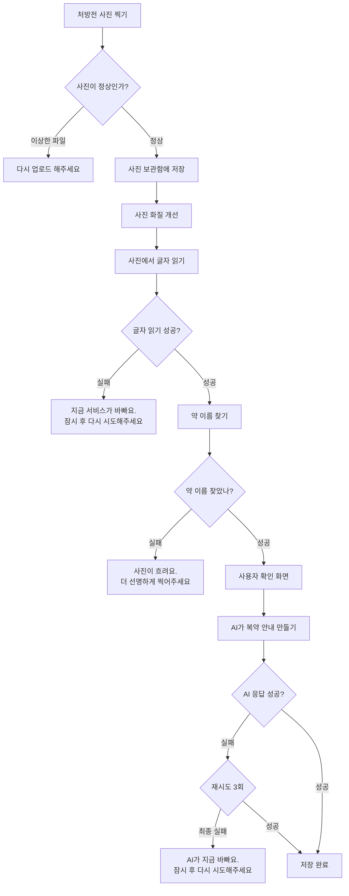
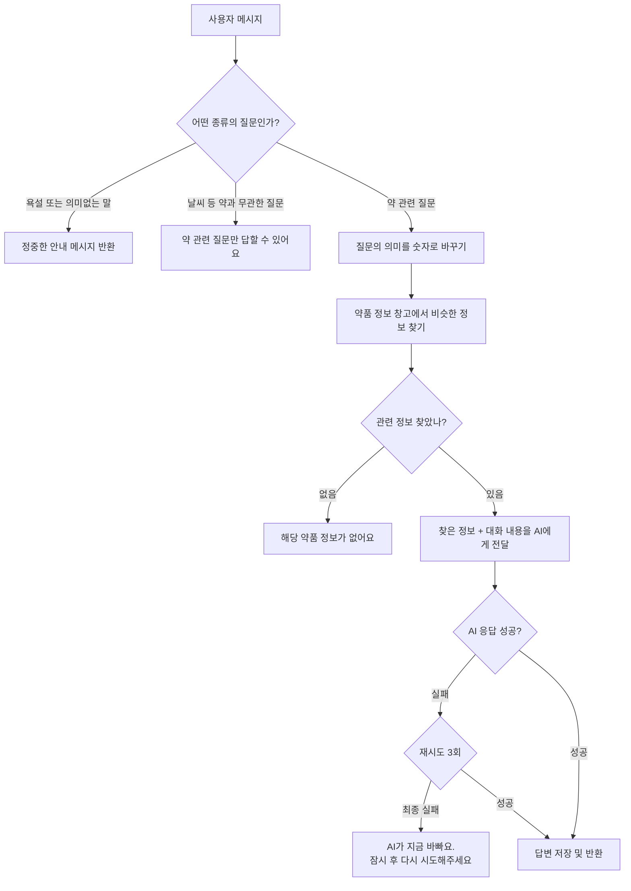

# PLAN: OCR 이미지 전처리 + DB 후처리 개선

## 개요

OCR 파이프라인의 정확도와 안정성을 높이기 위해 두 가지 독립적인 개선을 수행합니다.

- **Feature A (전처리)**: Clova OCR 호출 전 이미지 품질을 향상시켜 인식률을 높입니다.
- **Feature B (후처리)**: DB 저장을 트랜잭션으로 묶고, UPSERT 패턴 및 pg_trgm 인덱스를 도입합니다.

---

## 현재 파이프라인 (As-Is)



**문제점**

| 구분 | 현상 | 위험도 |
|---|---|---|
| 전처리 없음 | 저화질 이미지에서 OCR 오인식 발생 | 중 |
| 트랜잭션 없음 | 중간 실패 시 일부만 저장되는 partial write | 높음 |
| UPSERT 없음 | 동일 처방전 재등록 시 중복 레코드 생성 | 높음 |
| medicine_name 인덱스 없음 | 약품명 검색 시 full scan | 중 |
| traceback 노출 | 500 에러 시 서버 내부 정보가 클라이언트에 노출 | 높음 |

---

## 목표 파이프라인 (To-Be)



---

## Feature A: 이미지 전처리 (ImagePreprocessor)

### 신규 파일: `app/services/image_preprocessor.py`

**전처리 파이프라인 (순서 고정)**



**설계 원칙**
- `ImagePreprocessor` 클래스: SRP, 각 단계가 독립 메서드
- 전처리 실패 시 원본 이미지로 fallback (OCR 자체를 막지 않음)
- 임시 파일 생성 후 Clova OCR 전달, 완료 후 삭제
- 의존성: `opencv-python-headless`, `pillow` (이미 requirements에 포함 여부 확인 필요)

**인터페이스**

```python
class ImagePreprocessor:
    async def enhance(self, image_path: str) -> str:
        """전처리된 임시 이미지 경로 반환. 실패 시 원본 경로 반환."""
        ...
    
    def _to_grayscale(self, img: np.ndarray) -> np.ndarray: ...
    def _denoise(self, img: np.ndarray) -> np.ndarray: ...
    def _enhance_contrast(self, img: np.ndarray) -> np.ndarray: ...
    def _binarize(self, img: np.ndarray) -> np.ndarray: ...
    def _deskew(self, img: np.ndarray) -> np.ndarray: ...
```

**ocr_service.py 변경 범위 (Feature A)**
- `extract_and_parse_image()`: Clova OCR 호출 직전에 `ImagePreprocessor.enhance()` 삽입
- 변경 라인 수: ~5줄

---

## Feature B: DB 후처리 개선

### B-1. 트랜잭션 적용 (`ocr_service.py`)

```python
# Before (line 176-196)
for med_data in confirmed_medicines:
    await Medication.create(...)

# After
async with in_transaction():
    for med_data in confirmed_medicines:
        await Medication.get_or_create(
            profile_id=profile_id,
            medicine_name=med_data.medicine_name,
            dispensed_date=med_data.dispensed_date,
            defaults={...}
        )
```

**UPSERT 키**: `(profile_id, medicine_name, dispensed_date)`
- 동일 처방전 재등록 시 기존 레코드 업데이트 (중복 방지)
- `dispensed_date`가 null인 경우 처리 필요 (null은 unique key에서 제외)

### B-2. pg_trgm 마이그레이션

**신규 마이그레이션 파일**: `migrations/models/XXX_add_medicine_name_trgm_index.py`

```sql
-- Up
CREATE EXTENSION IF NOT EXISTS pg_trgm;
CREATE INDEX CONCURRENTLY idx_medication_medicine_name_trgm
    ON medication USING gin (medicine_name gin_trgm_ops);

-- Down
DROP INDEX IF EXISTS idx_medication_medicine_name_trgm;
```

### B-3. traceback 노출 제거 (`ocr_routers.py`)

```python
# Before (현재 코드)
except Exception as e:
    return JSONResponse(
        status_code=500,
        content={"detail": str(e), "traceback": traceback.format_exc()}
    )

# After
except Exception:
    logger.exception("OCR confirm 처리 중 예기치 않은 오류")
    raise HTTPException(status_code=500, detail="처리 중 오류가 발생했습니다.")
```

---

## 개발 순서 (3-Step Cycle)

### Feature A 개발 순서

| 단계 | 작업 |
|---|---|
| Tidy | `ocr_service.py` import 정리, 함수 길이 점검 |
| Test (Red) | `test_image_preprocessor.py`: enhance 성공 케이스 + fallback 케이스 |
| Implement (Green) | `image_preprocessor.py` 구현 + `ocr_service.py` 연동 |

### Feature B 개발 순서

| 단계 | 작업 |
|---|---|
| Tidy | `confirm_and_save()` 함수 분리 (현재 한 함수에 너무 많은 책임) |
| Test (Red) | `test_ocr_service.py`: 트랜잭션 롤백 케이스, UPSERT 중복 케이스 |
| Implement (Green) | `in_transaction()` 적용, UPSERT 패턴 적용, 마이그레이션 추가 |

---

## 체크리스트

### Feature A
- [ ] `opencv-python-headless`, `pillow` requirements 확인
- [ ] `ImagePreprocessor` 클래스 구현
- [ ] `enhance()` fallback 동작 테스트
- [ ] `ocr_service.py` 연동 (5줄 내외)

### Feature B
- [ ] `confirm_and_save()` Tidy (단일 책임 분리)
- [ ] `in_transaction()` 적용
- [ ] UPSERT 키 설계 (`dispensed_date` null 처리)
- [ ] pg_trgm 마이그레이션 작성
- [ ] traceback 노출 제거 + `logger.exception()` 적용
- [ ] `medication.py` 모델에 인덱스 추가

---

## 영향 범위

| 파일 | 변경 유형 |
|---|---|
| `app/services/image_preprocessor.py` | 신규 생성 |
| `app/services/ocr_service.py` | 수정 (전처리 연동 + 트랜잭션 + UPSERT) |
| `app/apis/v1/ocr_routers.py` | 수정 (traceback 제거) |
| `app/models/medication.py` | 수정 (인덱스 추가) |
| `migrations/models/XXX_add_trgm.py` | 신규 생성 |
| `tests/test_image_preprocessor.py` | 신규 생성 |
| `tests/test_ocr_service.py` | 수정 (트랜잭션/UPSERT 테스트 추가) |

---

*`go` 명령어를 입력하시면 Feature A Tidy 단계부터 시작합니다.*

---

## 핵심 프로세스 플로우차트

### OCR 전체 흐름



---

### 챗봇 대화 흐름


