---

# 약품 데이터 통합 + RAG 파이프라인 + 툴콜링 계획

## 전체 시스템 Flowchart

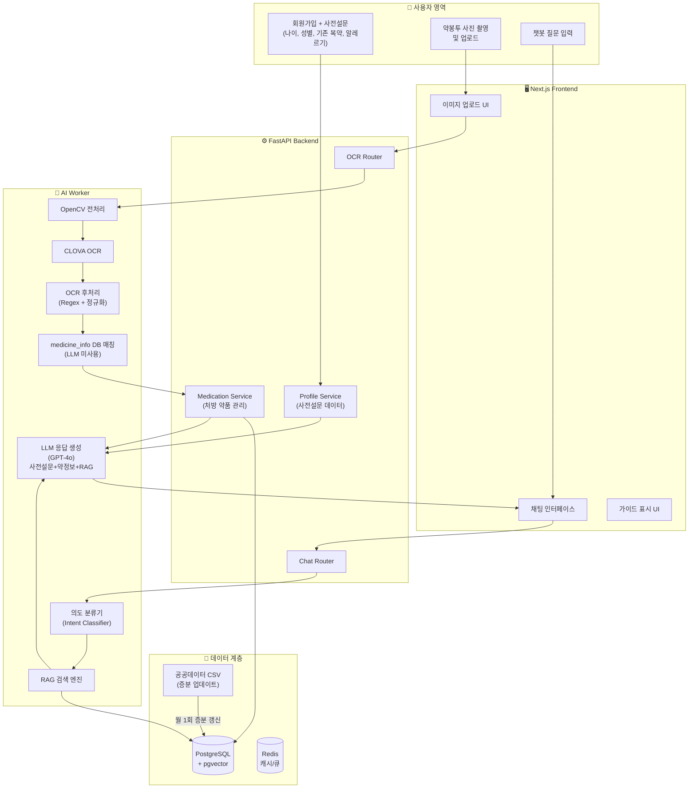

---

## Phase 1: 공공데이터 약품 DB 구축 (상세 구현)

### 1.0 Goal

- 식약처 공공데이터포털 의약품 허가정보 API 3종 연동
- `medicine_info` 모델 확장 (API 필드 매핑 + 증분 추적)
- `data_sync_log` 모델 신규 생성 (동기화 이력 관리)
- 최초 전체 수집(Full Sync) + 월 1회 증분 업데이트(Incremental Sync)
- OCR 이미지 전처리(OpenCV) 및 텍스트 후처리 모듈 분리
- 병원 전용 주사제 등 환자 불필요 데이터 필터링

### 1.1 API 연동 정보

| 항목 | 값 |
|------|-----|
| **Base Endpoint** | `https://apis.data.go.kr/1471000/DrugPrdtPrmsnInfoService07` |
| **허가 상세정보** | `/getDrugPrdtPrmsnDtlInq06` (메인 수집 대상) |
| **허가 목록** | `/getDrugPrdtPrmsnInq07` (보조 참조) |
| **주성분 상세** | `/getDrugPrdtMcpnDtlInq07` (성분 정보 보강) |
| **인증 방식** | serviceKey (URL Encode), 무료 |
| **일일 트래픽** | 10,000 건/일 |
| **응답 형식** | JSON (type=json) |
| **전체 데이터** | ~43,266 건 (2026-04 기준) |

**증분 업데이트용 파라미터:**
- `start_change_date` / `end_change_date` (YYYYMMDD) : 변경일자 범위 필터
- `item_seq` : 품목기준코드 (Unique Key, UPSERT 기준)

### 1.2 데이터 수집 및 저장 전략

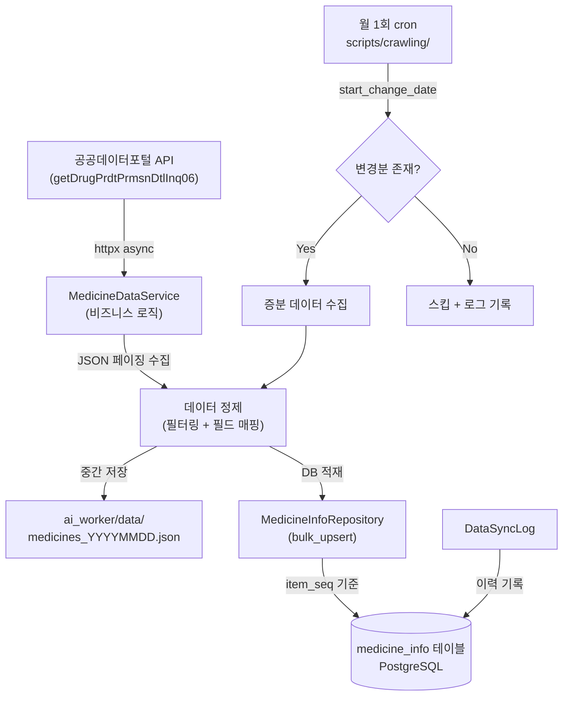

### 1.3 증분 업데이트 전략

```python
# 핵심 로직 (pseudo-code)
async def sync_medicine_data(full_sync: bool = False):
    """전체/증분 동기화 실행."""
    if full_sync:
        raw_items = await fetch_all_pages(endpoint, params={})
    else:
        last_sync = await DataSyncLog.filter(
            sync_type="medicine_info", status="SUCCESS"
        ).order_by("-sync_date").first()

        start_date = last_sync.sync_date.strftime("%Y%m%d") if last_sync else "20200101"
        raw_items = await fetch_all_pages(
            endpoint, params={"start_change_date": start_date}
        )

    if not raw_items:
        return  # No new data

    # Filter: remove hospital-only injectables
    filtered = [
        item for item in raw_items
        if not _is_hospital_only_injectable(item)
    ]

    # Bulk upsert via repository (item_seq as unique key)
    stats = await medicine_info_repo.bulk_upsert(filtered)

    # Log sync result
    await DataSyncLog.create(
        sync_type="medicine_info",
        total_fetched=len(raw_items),
        total_inserted=stats["inserted"],
        total_updated=stats["updated"],
        status="SUCCESS",
    )
```

### 1.4 모델 변경: medicine_info 확장

| 필드 | 타입 | API 매핑 | 설명 |
|------|------|----------|------|
| `item_seq` | VARCHAR(20), UNIQUE | ITEM_SEQ | 품목기준코드 (UPSERT PK) |
| `medicine_name` | VARCHAR(200) | ITEM_NAME | 약품명 (기존, max_length 확장) |
| `item_eng_name` | VARCHAR(256) | ITEM_ENG_NAME | 영문 약품명 |
| `entp_name` | VARCHAR(128) | ENTP_NAME | 제조업체명 |
| `product_type` | VARCHAR(64) | PRDUCT_TYPE | 제품 유형 ([03310]혈액대용제 등) |
| `spclty_pblc` | VARCHAR(32) | SPCLTY_PBLC | 전문/일반의약품 구분 |
| `permit_date` | VARCHAR(8) | ITEM_PERMIT_DATE | 허가일자 (YYYYMMDD) |
| `cancel_name` | VARCHAR(16) | CANCEL_NAME | 상태 (정상/취소) |
| `change_date` | VARCHAR(8) | - | 마지막 변경일자 |
| `main_item_ingr` | TEXT | MAIN_ITEM_INGR | 유효성분 |
| `storage_method` | TEXT | STORAGE_METHOD | 저장방법 |
| `edi_code` | VARCHAR(256) | EDI_CODE | 보험코드 |
| `bizrno` | VARCHAR(16) | BIZRNO | 사업자등록번호 |
| `category` | VARCHAR(64) | (기존) | 약품 분류 |
| `efficacy` | TEXT | (기존) | 효능/효과 |
| `side_effects` | TEXT | (기존) | 부작용 |
| `precautions` | TEXT | (기존) | 주의사항 |
| `embedding` | TEXT | (기존) | 임베딩 벡터 |
| `last_synced_at` | DatetimeField | - | 마지막 동기화 시각 |

### 1.5 신규 모델: data_sync_log

| 필드 | 타입 | 설명 |
|------|------|------|
| `id` | BigInt PK | 내부용 |
| `sync_type` | VARCHAR(32) | 동기화 대상 (medicine_info) |
| `sync_date` | DatetimeField | 동기화 실행 시각 |
| `total_fetched` | Int | API에서 수집한 총 건수 |
| `total_inserted` | Int | 신규 삽입 건수 |
| `total_updated` | Int | 업데이트 건수 |
| `status` | VARCHAR(16) | SUCCESS / FAILED |
| `error_message` | TEXT, nullable | 실패 시 에러 메시지 |
| `created_at` | DatetimeField | 레코드 생성 시각 |

### 1.6 파일 구조 및 Affected Files

| 파일 | 변경 내용 | 상태 |
|------|----------|------|
| `app/models/medicine_info.py` | API 필드 매핑 확장 (item_seq, entp_name 등) | 수정 |
| `app/models/data_sync_log.py` | 동기화 이력 모델 신규 생성 | 신규 |
| `app/repositories/medicine_info_repository.py` | CRUD + bulk_upsert + 검색 | 신규 |
| `app/services/medicine_data_service.py` | API 수집 + 정제 + 동기화 로직 | 신규 |
| `ai_worker/utils/image_preprocessor.py` | OpenCV 전처리 (Grayscale, Blur, Threshold, Morphology) | 신규 |
| `ai_worker/utils/text_postprocessor.py` | OCR 후처리 (Regex, Blacklist, 정규화) | 신규 |
| `ai_worker/tasks/ocr_tasks.py` | 전처리/후처리 모듈 통합 | 수정 |
| `ai_worker/core/config.py` | CLOVA_OCR_URL, CLOVA_OCR_SECRET, DATA_GO_KR_API_KEY 추가 | 수정 |
| `app/core/config.py` | DATA_GO_KR_API_KEY 추가 | 수정 |
| `app/db/databases.py` | MODELS 리스트에 data_sync_log 추가 | 수정 |
| `scripts/crawling/sync_medicine_data.py` | CLI 진입점 (전체/증분 동기화) | 신규 |
| `docs/db_schema.dbml` | medicine_info 확장 + data_sync_log 추가 | 수정 |
| `envs/example.local.env` | DATA_GO_KR_API_KEY 항목 추가 | 수정 |

### 1.7 OCR 파이프라인 (LLM 미사용, DB 매칭 방식)

> **핵심 원칙**: OCR 단계에서는 LLM을 사용하지 않는다.
> 약품 식별은 medicine_info DB 매칭으로 수행하고,
> LLM은 Phase 3 RAG 파이프라인에서만 사용한다.

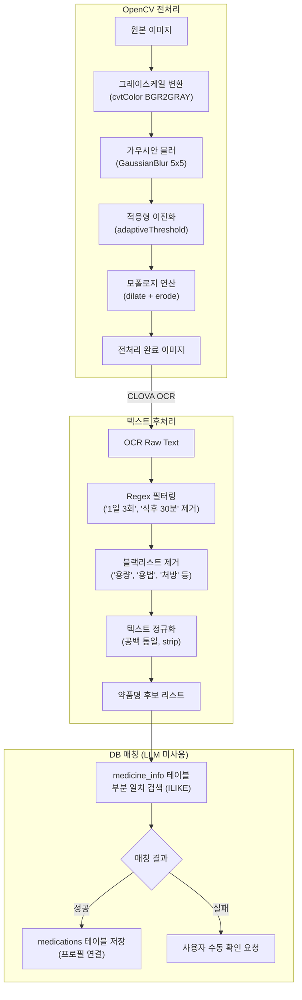

**올바른 전체 흐름 (Phase별 LLM 사용 시점)**
```
Phase 2 (OCR): 사진 -> OpenCV -> CLOVA OCR -> 텍스트 후처리
               -> pg_trgm 유사도 검색 (오타 보정) -> DB 매칭 확정 -> medications 저장
Phase 3 (RAG): 사용자 질문 + 사전설문(health_survey) + 복용약(medications)
               -> pgvector 의미 검색 + RAG 컨텍스트 조합 -> LLM(GPT-4o)
```

**유사도 검색 도구 구분**
| 도구 | 용도 | Phase | 예시 |
|------|------|-------|------|
| pg_trgm (문자 유사도) | OCR 오타 보정 | Phase 2 | "다이레놀" -> "타이레놀" (score: 0.65) |
| pgvector (의미 유사도) | RAG 질의응답 | Phase 3 | "두통약 추천" -> 관련 약품 목록 |

### 1.8 TDD Steps

#### Step 1: Model / Migration
- [ ] Red: medicine_info 확장 필드 검증 테스트 + data_sync_log 필드 테스트
- [ ] Green: 모델 정의 + aerich migrate
- [ ] Refactor: docs/db_schema.dbml 업데이트

#### Step 2: Repository
- [ ] Red: `app/tests/test_medicine_info_repository.py` (bulk_upsert, 검색)
- [ ] Green: `app/repositories/medicine_info_repository.py` 구현
- [ ] Refactor: soft delete 미적용 확인 (캐시성 테이블)

#### Step 3: Service
- [ ] Red: `app/tests/test_medicine_data_service.py` (API 수집, 정제, 동기화)
- [ ] Green: `app/services/medicine_data_service.py` 구현
- [ ] Refactor: httpx timeout/retry, 에러 처리 강화

#### Step 4: OCR Modules
- [ ] Red: `ai_worker/tests/test_image_preprocessor.py` + `test_text_postprocessor.py`
- [ ] Green: 전처리/후처리 모듈 구현
- [ ] Refactor: ocr_tasks.py 통합

#### Step 5: Scripts
- [ ] `scripts/crawling/sync_medicine_data.py` CLI 엔트리포인트

### 1.9 Trade-off Decisions

| 항목 | 선택 | 대안 | 이유 |
|------|------|------|------|
| HTTP 클라이언트 | httpx.AsyncClient | requests | 프로젝트 표준 (async 필수), 이미 의존성에 포함 |
| DB 적재 방식 | Tortoise ORM bulk_upsert | Raw SQL / psycopg2 | 아키텍처 일관성, 마이그레이션 호환 |
| 중간 저장 | JSON (ai_worker/data/) | CSV (pandas) | pandas 의존성 불필요, JSON이 API 응답과 동일 형태 |
| UPSERT 기준 | item_seq (품목기준코드) | medicine_name | item_seq가 식약처 공식 고유키, 약품명은 변경 가능 |
| 필터링 시점 | DB 적재 전 (수집 시) | DB 적재 후 (조회 시) | 불필요 데이터 저장 방지, DB 용량 절약 |
| 동기화 주기 | 월 1회 (cron) | 실시간 | 일일 트래픽 10,000건 제한, 데이터 변경 빈도 낮음 |

---

## Phase 1.5: RAG 임베딩 스키마 & 청킹 파이프라인 (금일 착수)

### 1.5.0 Goal

- `medicine_info`의 `embedding` 단일 컬럼 방식을 **청크 기반 pgvector 구조**로 전환
- `medicine_chunk`(청크 + 벡터), `medicine_ingredient`(주성분 1:N) 신규 테이블 도입
- 공공데이터 API XML 구조(`EE_DOC_DATA` / `UD_DOC_DATA` / `NB_DOC_DATA`) 기반 **ARTICLE 단위 청킹**
- `jhgan/ko-sroberta-multitask` (768-dim) 임베딩 모델에 맞는 `vector(768)` + HNSW 인덱스 확정
- 사용자 질의의 **도메인 분류 → 정규화 → 단일 벡터 검색** 파이프라인 확정 (질의 청킹 없음)

### 1.5.1 스키마 변경 개요

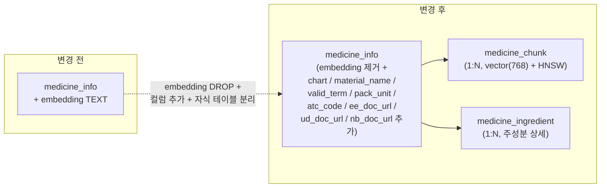

### 1.5.2 변경: `medicine_info`

| 동작 | 필드 | 타입 | 근거 |
|------|------|------|------|
| DROP | `embedding` | TEXT | 청크 테이블로 이관 (약 1건 ≠ 1벡터) |
| ADD | `chart` | TEXT nullable | `CHART` (성상/형태) — 약 식별 질의 |
| ADD | `material_name` | TEXT nullable | `MATERIAL_NAME` (총량/분량) |
| ADD | `valid_term` | VARCHAR(64) nullable | `VALID_TERM` (유효기간) |
| ADD | `pack_unit` | VARCHAR(256) nullable | `PACK_UNIT` (포장단위) |
| ADD | `atc_code` | VARCHAR(32) nullable | `ATC_CODE` (WHO 분류, 카테고리 보조) |
| ADD | `ee_doc_url` | VARCHAR(256) nullable | `EE_DOC_ID` (효능 PDF 원본) |
| ADD | `ud_doc_url` | VARCHAR(256) nullable | `UD_DOC_ID` (용법 PDF 원본) |
| ADD | `nb_doc_url` | VARCHAR(256) nullable | `NB_DOC_ID` (주의사항 PDF 원본) |

### 1.5.3 신규: `medicine_chunk`

| 필드 | 타입 | 설명 |
|------|------|------|
| `id` | BIGINT PK | 내부키 |
| `medicine_info_id` | INT FK | `medicine_info.id`, ON DELETE CASCADE |
| `section` | VARCHAR(48) | 청크 타입 (아래 enum) |
| `chunk_index` | INT default 0 | ARTICLE이 128토큰 초과 시 분할 순번 |
| `content` | TEXT not null | 헤더 프리픽스 포함 최종 임베딩 대상 문자열 |
| `token_count` | INT | 모니터링용 |
| `embedding` | VECTOR(768) | `jhgan/ko-sroberta-multitask` |
| `model_version` | VARCHAR(64) | 재임베딩 추적용 (예: `ko-sroberta-multitask-v1`) |
| `created_at` | TIMESTAMPTZ | |
| `updated_at` | TIMESTAMPTZ | |

**Unique**: `(medicine_info_id, section, chunk_index)`
**Index**: `embedding` HNSW `vector_cosine_ops` (m=16, ef_construction=64)

**`section` enum (v2 — 6종 고정, 수요자 질문 기준)**:
```
overview | intake_guide | drug_interaction |
lifestyle_interaction | adverse_reaction | special_event
```

**신규 컬럼 — `interaction_tags jsonb` (v2)**:
청크에 세분화 필터 태그를 JSONB 배열로 부여한다 (예: `["alcohol", "condition:liver"]`).
GIN 인덱스로 태그 매칭을 ms 단위 처리. 태그 사전 시드는
[ai_worker/data/interaction_tags.json](ai_worker/data/interaction_tags.json) 참조.

### 1.5.4 신규: `medicine_ingredient` (1:N 주성분)

| 필드 | 타입 | API 매핑 |
|------|------|----------|
| `id` | BIGINT PK | - |
| `medicine_info_id` | INT FK | `ITEM_SEQ`로 조인 |
| `mtral_sn` | INT | `MTRAL_SN` |
| `mtral_code` | VARCHAR(16) | `MTRAL_CODE` (M040702 등) |
| `mtral_name` | VARCHAR(128) | `MTRAL_NM` (포도당) |
| `main_ingr_eng` | VARCHAR(256) | `MAIN_INGR_ENG` (Glucose) |
| `quantity` | VARCHAR(32) | `QNT` |
| `unit` | VARCHAR(16) | `INGD_UNIT_CD` (그램 등) |
| `created_at` | TIMESTAMPTZ | |

**Unique**: `(medicine_info_id, mtral_sn)`
**Index**: `mtral_name`

### 1.5.5 Aerich 마이그레이션 설계

Aerich는 pgvector/HNSW를 자동 생성하지 못하므로 **수동 SQL 블록 병합**이 필수입니다.

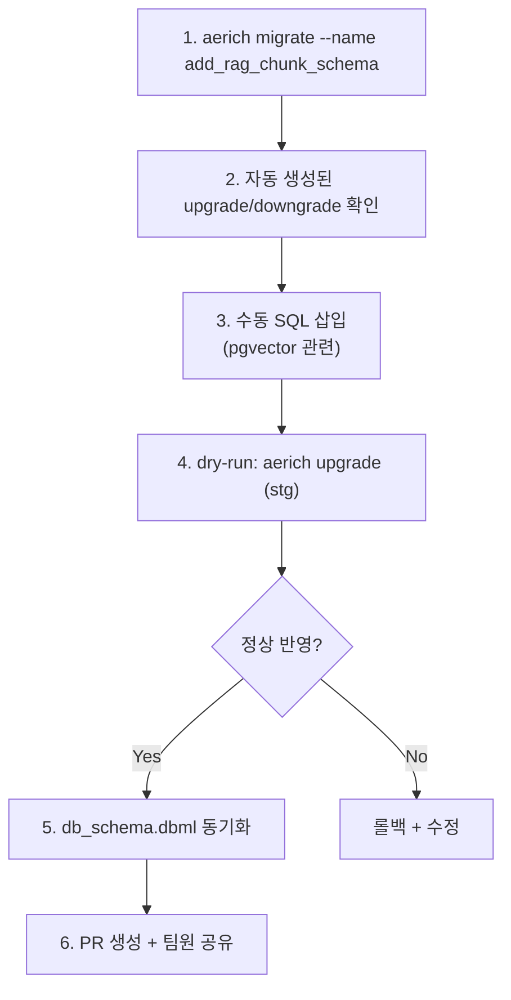

**upgrade() 수동 삽입 SQL** (Aerich 자동 생성 구문 앞/뒤에 덧붙임):
```sql
-- pgvector 확장은 이미 설치되어 있지만 idempotent 보장
CREATE EXTENSION IF NOT EXISTS vector;

-- medicine_info.embedding DROP (팀원이 사전 백업 확인 예정)
ALTER TABLE medicine_info DROP COLUMN IF EXISTS embedding;

-- medicine_chunk.embedding 컬럼 추가 (Aerich가 vector 타입을 모름)
ALTER TABLE medicine_chunk
  ADD COLUMN embedding vector(768);

-- HNSW 인덱스
CREATE INDEX IF NOT EXISTS idx_medicine_chunk_embedding_hnsw
  ON medicine_chunk
  USING hnsw (embedding vector_cosine_ops)
  WITH (m = 16, ef_construction = 64);
```

**downgrade()**:
```sql
DROP INDEX IF EXISTS idx_medicine_chunk_embedding_hnsw;
-- medicine_chunk 테이블 자체는 Aerich가 drop
ALTER TABLE medicine_info ADD COLUMN embedding TEXT;
```

### 1.5.6 문서 청킹 파이프라인 — 수요자 중심 재설계 (v2)

#### 설계 전환 배경

초기 v1은 공공데이터 API 의 XML 구조(ARTICLE title) 그대로 13종 section enum 을
정의한 **공급자 중심** 설계였다. 실제 사용자 질의 유형을 역설계해 보니
"한약이랑 먹어도?", "레이저 시술 받아도?", "커피 마셔도?" 같은 질문이
`precaution_general` 단일 청크에 뭉뚱그려져 벡터 검색 노이즈가 크게 발생한다.

**v2 방향**: 섹션은 "사용자 질문 카테고리" 기준 **6종으로 축소**하고, 세부
상호작용은 **`interaction_tags` JSONB 레이어**로 분리한다. 청킹은 PARAGRAPH
단위까지 쪼갤 수 있으며, 각 청크는 "큰 카테고리(section) + 정밀 필터(tags)"
이중 색인을 가진다.

#### 청크 6종 (section enum)

| # | section | 포함 내용 | 대표 사용자 질문 | 원본 XML 매핑 |
|---|---------|----------|----------|--------------|
| 1 | **`overview`** | 효능·적응증·약의 정체성 | "이 약 뭐야?", "두통에 뭐 먹어?" | `EE_DOC_DATA` 전체 |
| 2 | **`intake_guide`** | 복용법·타이밍·제형·잊은 경우 대처 | "공복?", "쪼개 먹어도?", "약 까먹었어" | `UD_DOC_DATA` 전체 + 메타 합성 |
| 3 | **`drug_interaction`** | 약·영양제·한약·건기식 병용 | "홍삼이랑?", "와파린 같이?" | NB_DOC "2. 투여 금지" 약물 문단 + "5. 일반적 주의" 약물 상호작용 |
| 4 | **`lifestyle_interaction`** | 음식·음주·카페인·운전·운동·햇빛 | "커피?", "술?", "운전?" | NB_DOC "5. 일반적 주의" 음식/행동 문단 |
| 5 | **`adverse_reaction`** | 흔한 부작용 + 중증 이상반응 + 과량 대처 | "두드러기 나는데?", "토했어" | NB_DOC "4. 이상반응" + "9. 과량투여" |
| 6 | **`special_event`** | 수술·시술·검사·임신·수유·소아·고령·보관 | "레이저?", "수술 앞두고?", "임신 중" | NB_DOC "6. 임부" + "7. 소아" + "8. 고령자" + 수술 문단 + `STORAGE_METHOD` |

성분(`ingredient`)은 별도 청크로 만들지 않는다. "내 알레르기 성분 포함?"
류 질문은 `medicine_ingredient` 테이블을 직접 SQL 조회한다.

#### interaction_tags 레이어 (JSONB)

청크 1개에 여러 태그를 붙여 정밀 필터링을 가능케 한다. 예:

```json
{
  "medicine_info_id": 42,
  "section": "lifestyle_interaction",
  "content": "타이레놀 주의: 음주 시 간독성 증가",
  "interaction_tags": ["alcohol", "condition:liver"]
}
```

태그 카테고리 (10종, 초기 시드):

| prefix | 예시 값 |
|--------|--------|
| `food` | `grapefruit`, `dairy`, `vitamin_k`, `high_fiber` |
| `beverage` | `alcohol`, `caffeine`, `energy_drink` |
| `drug` | `herbal`, `anticoagulant`, `nsaid`, `statin`, `ssri`, `oral_contraceptive` |
| `procedure` | `surgery`, `laser`, `imaging_mri`, `imaging_ct`, `dental`, `tattoo`, `vaccination` |
| `condition` | `pregnancy`, `breastfeeding`, `liver`, `kidney`, `diabetes`, `hypertension`, `glaucoma` |
| `activity` | `driving`, `exercise`, `swimming`, `heavy_machinery` |
| `exposure` | `sunlight`, `heat`, `cold` |
| `timing` | `empty_stomach`, `post_meal`, `bedtime`, `morning` |
| `demographic` | `pediatric`, `elderly`, `adolescent` |
| `emergency` | `anaphylaxis`, `overdose`, `severe_allergy` |

태그 사전은 `ai_worker/data/interaction_tags.json` 에 시드로 관리하며,
청킹 시점에 **규칙 기반 80% + LLM 폴백 20%** 로 자동 부여한다.

#### 배치 파이프라인 (Mermaid)

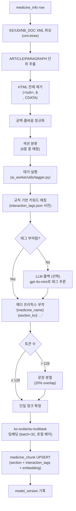

#### 섹션 매핑 규칙 (v1 → v2 통합표)

| XML 원본 ARTICLE title | v1 enum (13종) | **v2 enum (6종)** |
|---|---|---|
| EE_DOC 전체 | `efficacy` | **`overview`** |
| UD_DOC 전체 | `usage` | **`intake_guide`** |
| `1. 경고` | `precaution_warning` | **`drug_interaction`**(약물 경고) OR **`adverse_reaction`**(증상 경고) |
| `2. 투여 금지` | `precaution_contraindication` | **`drug_interaction`**(약물 병용) OR **`special_event`**(생리상태) |
| `3. 신중히 투여` | `precaution_caution` | **`special_event`** (기저질환·생리상태) |
| `4. 이상반응` | `adverse_reaction` | **`adverse_reaction`** |
| `5. 일반적 주의` | `precaution_general` | **`drug_interaction`** 또는 **`lifestyle_interaction`** (내용 따라 분기) |
| `6. 임부` / `수유부` | `precaution_pregnancy` | **`special_event`** (+ `condition:pregnancy` 태그) |
| `7. 소아` | `precaution_pediatric` | **`special_event`** (+ `demographic:pediatric` 태그) |
| `8. 고령자` | `precaution_elderly` | **`special_event`** (+ `demographic:elderly` 태그) |
| `9. 과량투여` | `precaution_overdose` | **`adverse_reaction`** (+ `emergency:overdose` 태그) |
| `storage_method` (메타) | `storage` | **`special_event`** |

**"5. 일반적 주의" 분기 규칙**: PARAGRAPH 단위로 쪼갠 뒤, 해당 문단에
약물 키워드(`와파린`, `항응고제` 등)가 있으면 `drug_interaction`, 음식/음주/
활동 키워드가 있으면 `lifestyle_interaction` 으로 분류. 둘 다 있으면 **문단을
분리해 각자 다른 청크로 저장**.

#### 스킵 규칙

- 텍스트 20자 미만 ARTICLE/PARAGRAPH → 스킵
- `<ARTICLE title="..." />` (자체 종료 태그, 본문 없음) → 스킵

#### 쿼리 시 태그 활용

```sql
-- 예: "이 약 먹는데 레이저 시술 받아도?" (복용 중 타이레놀)
SELECT content, embedding <=> :query_vector AS distance
FROM medicine_chunk
WHERE medicine_info_id = :tylenol_id
  AND (section = 'special_event'
       OR interaction_tags @> '["procedure:laser"]'
       OR interaction_tags @> '["exposure:sunlight"]')
ORDER BY distance
LIMIT 5;
```

GIN 인덱스(`USING gin (interaction_tags)`)가 태그 필터 단계를
ms 단위로 처리해주므로, 벡터 검색 전에 **3중 필터(FK → 섹션 → 태그)**
로 범위를 극적으로 좁힐 수 있다.

### 1.5.7 쿼리 파이프라인 (실시간)

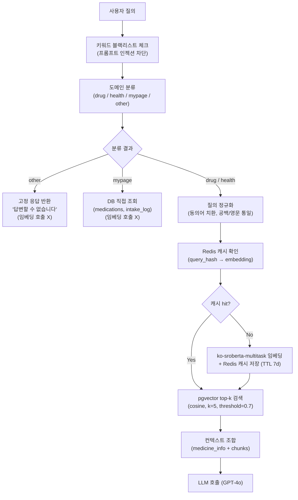

**도메인 분류는 초기 룰 기반**으로 시작(키워드 + 정규식), 오탐이 나오면 gpt-4o-mini 분류기로 승격. 임베딩 단계까지 가지 않고 초기에 컷하는 것이 핵심.

### 1.5.8 예상 질의 카테고리 (테스트 케이스 기반)

| 카테고리 | 예시 | 라우팅 |
|---|---|---|
| 약 정보 | "타이레놀 효능", "아스피린이 뭐야" | drug → `medicine_chunk` (efficacy, ingredient) |
| 부작용 | "이부프로펜 부작용" | drug → `adverse_reaction` |
| 복용법 | "공복에 먹어도 돼?" | drug → `usage`, `precaution_general` |
| 상호작용 | "타이레놀 맥주 같이" | drug → `precaution_general` + LLM |
| 보관 | "냉장고 넣어야 해?" | drug → `storage` |
| 증상→약 | "두통에 뭐 먹어?" | drug → `efficacy` 역검색 |
| 마이페이지 | "어제 먹은 약", "다음 복용시간" | mypage → DB 직접 조회 |
| OCR 후속 | "방금 찍은 처방전의 약" | drug → Redis 캐시 + `medicine_info` |
| 일상 잡담 | "새 봤어", "밥 뭐 먹지" | other → 고정 거절 |
| 의료 행위 | "암일까?", "약 바꿔도 돼?" | other → 전문가 상담 안내 |

### 1.5.9 Affected Files

| 파일 | 변경 내용 | 상태 |
|------|----------|------|
| `docs/db_schema.dbml` | medicine_info 컬럼 추가/embedding 제거 + medicine_chunk / medicine_ingredient 신규 | 수정 |
| `app/models/medicine_info.py` | 컬럼 추가(chart, material_name, valid_term, pack_unit, atc_code, ee_doc_url, ud_doc_url, nb_doc_url) + embedding 제거 | 수정 |
| `app/models/medicine_chunk.py` | 신규 Tortoise 모델 (section enum, chunk_index, content, token_count, model_version) | 신규 |
| `app/models/medicine_ingredient.py` | 신규 Tortoise 모델 (1:N 주성분) | 신규 |
| `app/db/databases.py` | MODELS 리스트에 medicine_chunk, medicine_ingredient 추가 | 수정 |
| `app/db/migrations/models/8_YYYYMMDD_add_rag_chunk_schema.py` | Aerich 자동 생성 + pgvector 수동 SQL 병합 | 신규 |
| `app/repositories/medicine_chunk_repository.py` | 청크 bulk upsert + 벡터 검색 쿼리 | 신규 |
| `app/repositories/medicine_ingredient_repository.py` | 주성분 bulk upsert | 신규 |
| `app/services/medicine_data_service.py` | API 수집 이후 ingredient upsert 단계 추가 | 수정 |
| `ai_worker/utils/chunker.py` | XML 파싱 + ARTICLE 청킹 + 헤더 프리픽스 | 수정 (기존 JSON 로더 로직 교체) |
| `ai_worker/utils/embedder.py` | ko-sroberta-multitask 배치 임베딩 래퍼 | 신규 |
| `ai_worker/tasks/embedding_tasks.py` | 초기 배치 + 증분 업서트 RQ 태스크 | 신규 |
| `scripts/embedding/build_medicine_chunks.py` | 43k 건 초기 임베딩 CLI | 신규 |

### 1.5.10 TDD Steps

#### Step 1: 스키마 & 마이그레이션
- [ ] Red: `app/tests/test_medicine_chunk_model.py` — section enum, unique(medicine_info_id, section, chunk_index), FK CASCADE
- [ ] Red: `app/tests/test_medicine_ingredient_model.py` — 1:N 조인, mtral_sn unique
- [ ] Green: 모델 3종 작성 + Aerich 마이그레이션 + 수동 SQL 병합
- [ ] Refactor: `docs/db_schema.dbml` 동기화

#### Step 2: Repository
- [ ] Red: `test_medicine_chunk_repository.py` — bulk_upsert, `search_by_vector(vec, k, filter_section)` 반환 형태·정렬·threshold
- [ ] Green: Repository 구현 (tortoise raw SQL + 파라미터 바인딩)
- [ ] Refactor: N+1 방지 `prefetch_related`

#### Step 3: 청킹 & 임베딩
- [ ] Red: `ai_worker/tests/test_chunker.py` — XML 파싱, HTML 태그 제거, ARTICLE enum 매핑, 128토큰 분할, 20자 미만 스킵
- [ ] Red: `test_embedder.py` — 배치 입출력 shape, model_version 기록, GPU/CPU fallback
- [ ] Green: chunker.py 재작성 + embedder.py 신규
- [ ] Refactor: 에러 핸들링 + 로깅

#### Step 4: 증분 파이프라인 통합
- [ ] Red: `test_embedding_tasks.py` — 증분 sync 이후 변경된 item_seq만 재임베딩
- [ ] Green: embedding_tasks.py 구현 (RQ)
- [ ] Refactor: model_version 불일치 시 재임베딩 로직

#### Step 5: 쿼리 파이프라인 (실시간)
- [ ] Red: `test_domain_classifier.py` — other/mypage/drug/health 분기
- [ ] Red: `test_query_pipeline.py` — 캐시 hit/miss, pgvector 호출 횟수
- [ ] Green: 분류기 + 정규화 + 검색 조립

#### Step 6: CLI 스크립트
- [ ] `scripts/embedding/build_medicine_chunks.py` — 초기 43k 배치 (진행률 로그, resume 지원)

### 1.5.11 Trade-off Decisions

| 항목 | 선택 | 대안 | 이유 |
|------|------|------|------|
| 청킹 단위 | ARTICLE (XML 자연경계) | 고정 토큰 sliding window | 의미 단위 보존, 토큰 낭비 최소 |
| 벡터 컬럼 위치 | `medicine_chunk` 분리 | `medicine_info` 그대로 | 128토큰 초과 정보가 인코딩에서 버려짐, 섹션별 검색 정확도 향상 |
| 인덱스 | HNSW | IVFFlat | 20만 벡터 규모에서 HNSW가 재현율·지연 모두 유리 (pgvector 0.5+) |
| 질의 임베딩 | 단일 벡터 | HyDE / MQR | 초기 구현 단순화, 정확도 이슈 발생 시 HyDE 승격 |
| 도메인 분류 | 룰 기반 선행 | LLM 분류기 즉시 도입 | 비용·지연·남용 방지, 오탐 발생 시 gpt-4o-mini 승격 |
| 질의 임베딩 캐시 | Redis (TTL 7d) | `query_embedding_cache` 테이블 | 초기엔 Redis로 충분, 장기 분석 필요 시 테이블로 승격 |
| pgvector 확장 설치 | 사전 설치 확인됨 | 마이그레이션에서 최초 설치 | idempotent `CREATE EXTENSION IF NOT EXISTS`만 남겨 안전망 확보 |
| `medicine_info.embedding` drop | 담당자 사전 백업 확인 후 drop | 컬럼 유지하고 deprecated 표시 | 스키마 오염 제거, 담당자가 백업 확인 예정 |

### 1.5.12 팀원 전달 패키지 (완료 후 공유 대상)

1. [docs/db_schema.dbml](docs/db_schema.dbml) — single source of truth
2. [app/models/medicine_info.py](app/models/medicine_info.py), `medicine_chunk.py`, `medicine_ingredient.py`
3. `app/db/migrations/models/8_*_add_rag_chunk_schema.py` (초기 테이블)
4. `app/db/migrations/models/9_*_redesign_chunk_schema.py` (v2 재설계 — enum 값 교체 + interaction_tags + GIN)
5. [ai_worker/data/interaction_tags.json](ai_worker/data/interaction_tags.json) — 태그 시드 사전
6. [ai_worker/utils/tagger.py](ai_worker/utils/tagger.py) — 규칙 기반 자동 태거

#### 스키마 락 **4조항** (v2 갱신)

- **락 ①** — `vector(768)` 차원, 모델 `jhgan/ko-sroberta-multitask` (변경 없음)
- **락 ②** — `section` enum **6종 고정** (v1의 13종에서 수요자 중심 6종으로 재설계):
  `overview` / `intake_guide` / `drug_interaction` / `lifestyle_interaction`
  / `adverse_reaction` / `special_event`
- **락 ③** — `model_version` not null (재임베딩 트리거, 변경 없음)
- **락 ④** — **신규**: `interaction_tags jsonb` 컬럼 + GIN 인덱스. 태그 값은
  `interaction_tags.json` 사전 기반이며 값 추가·변경 시 팀 공지 필수

---

## Phase 2: OCR 파이프라인 (약봉투 → 약품 정보)

### 2.1 OCR 전체 흐름

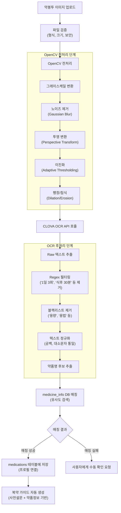

### 2.2 Regex 필터링 규칙

```python
# 제거 대상 패턴
REMOVE_PATTERNS = [
    r"\d+일\s*\d+회",      # "1일 3회"
    r"식(전|후)\s*\d+분?",  # "식후 30분"
    r"\d+일분",             # "7일분"
    r"\d+(정|캡슐|ml|mg|g|포)", # "1정", "500mg"
    r"(아침|점심|저녁|취침)",    # 시간 키워드
]

# 블랙리스트
BLACKLIST = ["용량", "용법", "처방", "조제", "약국", "의원", "병원"]
```

---

## Phase 3: RAG 파이프라인 (챗봇 응답 생성)

### 3.1 RAG 전체 흐름

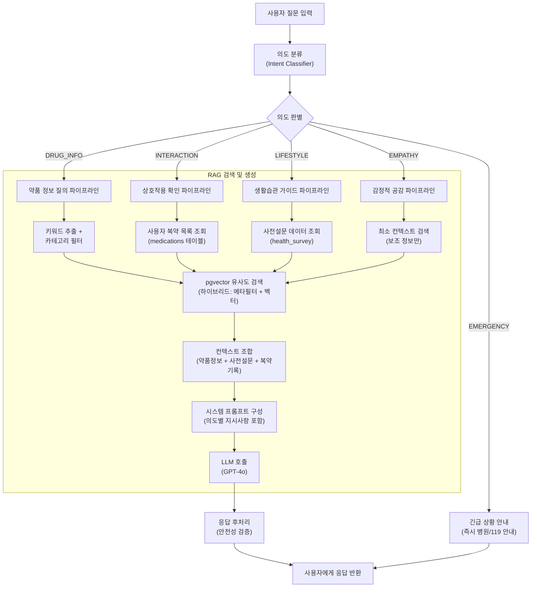

### 3.2 의도 분류 상세 설계

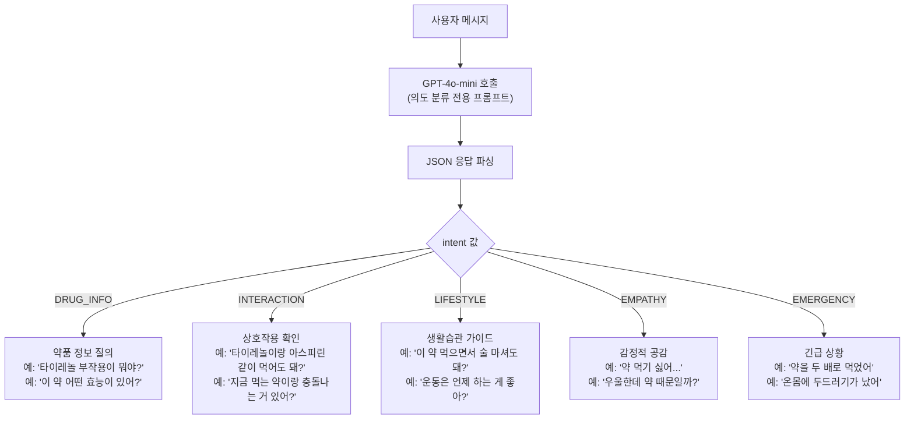

### 3.3 의도별 RAG 전략

| 의도 | 검색 범위 | 컨텍스트 구성 | 응답 톤 |
|------|-----------|---------------|---------|
| DRUG_INFO | medicine_info (카테고리 필터 + 벡터) | 약품 상세정보 | 정보 전달 위주 |
| INTERACTION | medications + drug_interaction_cache | 복용 중 약 목록 + 상호작용 데이터 | 주의/경고 포함 |
| LIFESTYLE | medicine_info + health_survey | 약품정보 + 사전설문(나이,성별,알레르기) | 맞춤형 조언 |
| EMPATHY | 최소 검색 (부작용 정보만 보조) | 공감 우선, 정보는 보조 | 따뜻하고 공감적 |
| EMERGENCY | 검색 스킵 | 하드코딩된 안전 메시지 | 즉각적, 명확한 지시 |

### 3.4 하이브리드 검색 구현 (인덱스 페이지 기반)

```python
# 메타데이터 필터 + 벡터 유사도 결합
async def hybrid_search(
    query: str,
    intent: str,
    category_filter: str | None = None,
    user_medications: list[str] | None = None,
    limit: int = 5,
) -> list[dict]:
    query_embedding = await get_embedding(query)

    # 의도에 따라 SQL 조건 동적 구성
    where_clauses = []
    params = [str(query_embedding), limit]

    if category_filter:
        where_clauses.append(f"category = ${len(params) + 1}")
        params.append(category_filter)

    if user_medications:
        placeholders = ", ".join(
            f"${i}" for i in range(len(params) + 1, len(params) + 1 + len(user_medications))
        )
        where_clauses.append(f"medicine_name IN ({placeholders})")
        params.extend(user_medications)

    where_sql = f"WHERE {' AND '.join(where_clauses)}" if where_clauses else ""

    sql = f"""
        SELECT medicine_name, category, efficacy, side_effects, precautions,
               embedding <=> $1::vector AS distance
        FROM medicine_info
        {where_sql}
        ORDER BY embedding <=> $1::vector
        LIMIT $2;
    """
    return await conn.execute_query_dict(sql, params)
```

---

## Phase 4: 툴콜링 (Tool Calling) 기능 — 수요일 이후 개발

### 4.1 툴콜링 전체 흐름

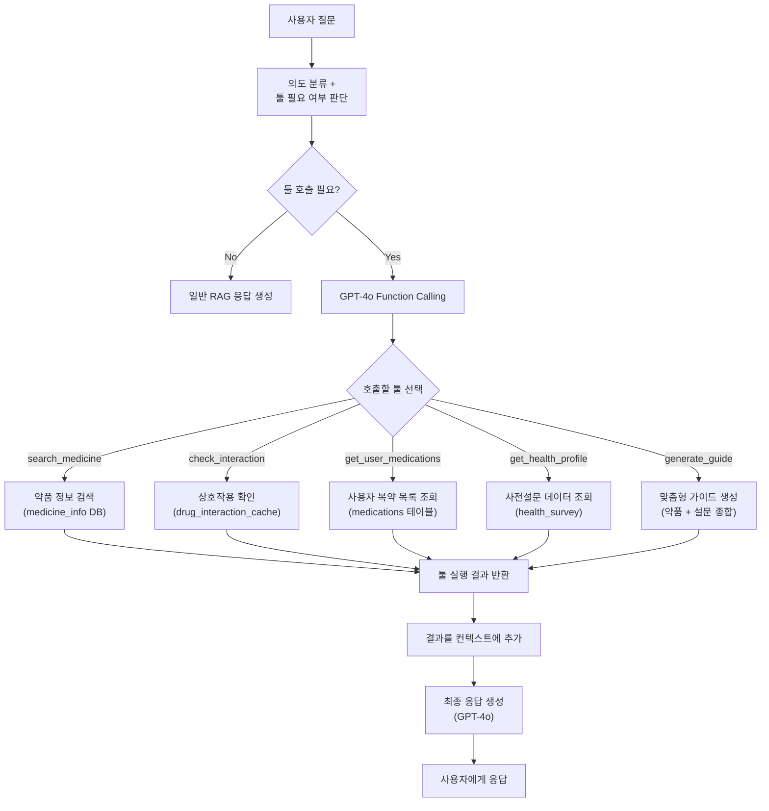

### 4.2 Tool 정의 (OpenAI Function Calling 형식)

```python
TOOLS = [
    {
        "type": "function",
        "function": {
            "name": "search_medicine",
            "description": "약품명으로 효능, 부작용, 주의사항 등을 검색합니다",
            "parameters": {
                "type": "object",
                "properties": {
                    "medicine_name": {
                        "type": "string",
                        "description": "검색할 약품명"
                    }
                },
                "required": ["medicine_name"]
            }
        }
    },
    {
        "type": "function",
        "function": {
            "name": "check_interaction",
            "description": "두 약품 간 상호작용을 확인합니다",
            "parameters": {
                "type": "object",
                "properties": {
                    "medicine_a": {"type": "string"},
                    "medicine_b": {"type": "string"}
                },
                "required": ["medicine_a", "medicine_b"]
            }
        }
    },
    {
        "type": "function",
        "function": {
            "name": "get_user_medications",
            "description": "현재 사용자가 복용 중인 약품 목록을 조회합니다",
            "parameters": {
                "type": "object",
                "properties": {}
            }
        }
    },
    {
        "type": "function",
        "function": {
            "name": "get_health_profile",
            "description": "사용자의 건강 설문 데이터(나이, 성별, 알레르기 등)를 조회합니다",
            "parameters": {
                "type": "object",
                "properties": {}
            }
        }
    },
    {
        "type": "function",
        "function": {
            "name": "generate_guide",
            "description": "약품 정보와 사용자 건강 프로필을 종합하여 맞춤형 복약 가이드를 생성합니다",
            "parameters": {
                "type": "object",
                "properties": {
                    "medicine_names": {
                        "type": "array",
                        "items": {"type": "string"},
                        "description": "가이드를 생성할 약품명 목록"
                    }
                },
                "required": ["medicine_names"]
            }
        }
    }
]
```

### 4.3 툴콜링 실행 엔진

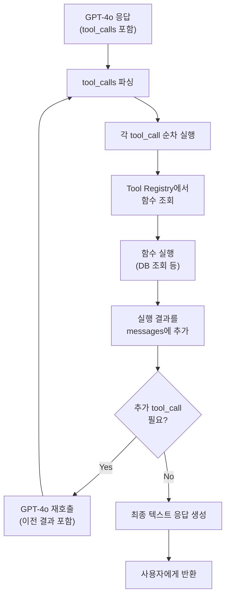

### 4.4 Tool Calling vs 순수 RAG 비교

| 항목 | 순수 RAG | Tool Calling |
|------|----------|-------------|
| 정보 소스 | 벡터 유사도 검색만 | DB 직접 조회 + 벡터 검색 |
| 정확도 | 유사도 기반 (근사) | 정확한 데이터 조회 |
| 복잡한 질의 | 단일 검색만 가능 | 다단계 조회 가능 |
| 예시 | "타이레놀 부작용" | "내가 먹는 약 중에 상호작용 위험한 조합 있어?" |
| 비용 | LLM 1회 호출 | LLM 2~3회 호출 |

---

## Phase 5: 맞춤형 복약/생활습관 가이드 자동 생성

### 5.1 가이드 생성 흐름

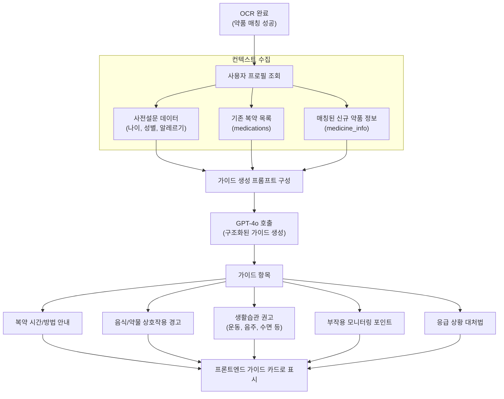

---

## 구현 일정

| Phase | 기간 | 내용 |
|-------|------|------|
| Phase 1 | 즉시 | 공공데이터 CSV → medicine_info DB 구축 + 증분 업데이트 스크립트 |
| Phase 2 | 이번 주 | OpenCV 전처리 + OCR 후처리 파이프라인 고도화 |
| Phase 3 | 이번 주 | RAG 파이프라인 (의도분류 + 하이브리드 검색) |
| Phase 4 | 수요일 이후 | Tool Calling 통합 (Function Calling 기반) |
| Phase 5 | Phase 2+3 완료 후 | 맞춤형 가이드 자동 생성 |

---

## 예상 파일 변경/생성

| 파일 | 변경 내용 |
|------|----------|
| `ai_worker/utils/ocr.py` | OpenCV 전처리 + OCR 후처리 추가 |
| `ai_worker/utils/rag.py` | 의도분류 + 하이브리드 검색 + 툴콜링 통합 |
| `ai_worker/utils/image_preprocessor.py` | 신규: OpenCV 전처리 모듈 |
| `ai_worker/utils/text_postprocessor.py` | 신규: OCR 텍스트 후처리 모듈 |
| `ai_worker/utils/intent_classifier.py` | 신규: 의도 분류 모듈 |
| `ai_worker/utils/tool_executor.py` | 신규: 툴콜링 실행 엔진 |
| `ai_worker/tasks/data_sync_tasks.py` | 신규: 공공데이터 증분 업데이트 태스크 |
| `app/models/medicine_info.py` | 메타데이터 컬럼 추가 (ingredient, usage 등) |
| `app/repositories/medicine_info_repository.py` | 하이브리드 검색 쿼리 |
| `scripts/sync_medicine_data.py` | 신규: 공공데이터 동기화 스크립트 |

