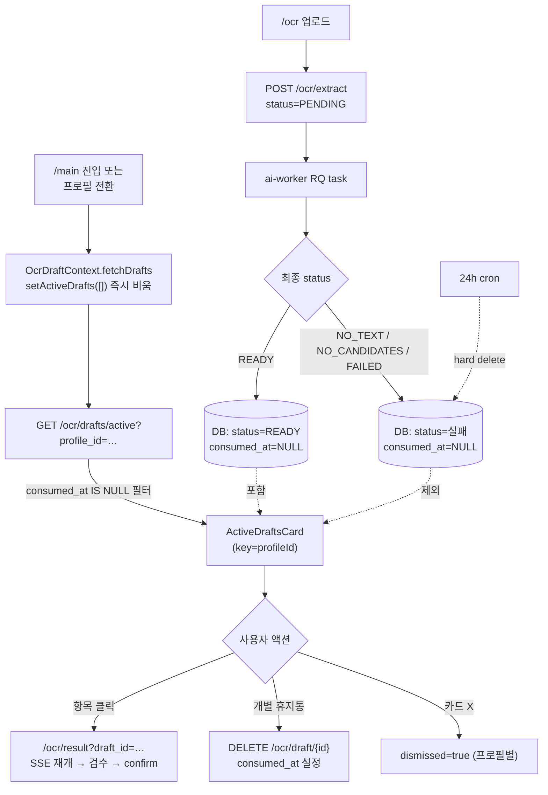

# PLAN — OCR 진행 탭 UX 정돈 (ActiveDraftsCard)

## 1. 문제 정의 (사용자 보고 ↔ 코드 동작 매핑)

사용자 보고: 메인 페이지 챗봇 위 "처방전 진행 탭"(`ActiveDraftsCard`)에 누적되는 항목들의 UX가 중구난방.

| # | 사용자 보고 | 실제 코드 동작 (탐색 결과) | 진짜 원인 |
|---|---|---|---|
| 1 | 인식 실패 상태가 떠 있음, 없었던 일로 롤백되어야 함 | `no_text` / `no_candidates` / `failed` draft 가 `consumed_at IS NULL` 인 채 24h 살아 있음. `list_active_drafts` 가 status 필터 없이 모두 반환 | BE 응답 필터 부재 |
| 2 | 확인 대기면 result 창으로 보내야 함 | `ready` 클릭 시 `/ocr/result?draft_id=…` 이동 — **이미 정상 동작** | 변경 없음 |
| 3 | 이미 저장된 건 안 떠야 함 | `consumed_at IS NULL` 필터 정상 동작 — **이미 정상** | 사용자 혼동의 실제 원인은 #1 (실패 누적) |
| 4 | 프로필 ID 별로 구분 안 되는 듯 | BE 필터·FE Context 필터 모두 적용. 단 (a) 프로필 전환 직후 이전 프로필 drafts 가 잠시 보임 (stale flicker), (b) `ActiveDraftsCard.dismissed` state 가 프로필 전환 후에도 유지 | FE transition 처리 미흡 |

## 2. 설계 결정

### A. 실패 status 자동 롤백 — **ai-worker 가 DB 자체를 정합 처리**

ai-worker 가 terminal failure (`no_text` / `no_candidates` / `failed`) 도달 시 그 자리에서 `consumed_at = NOW()` 를 설정한다 (자동 롤백). DB 가 항상 일관 — `consumed_at IS NULL` 필터만으로 활성 draft 가 정확히 정의된다.

**의미 매핑**:
- 롤백 (인식 실패) → ai-worker 가 자동 consumed_at 설정 → 24h cron 이 hard delete
- 임시저장 (pending/ready 로 사용자가 이탈) → consumed_at IS NULL 유지 → 카드 노출, 재진입 가능
- 명시적 폐기 (휴지통/"다시 촬영") → 사용자가 DELETE → consumed_at 설정 (기존 동작)
- 확정 저장 (confirm) → consumed_at 설정 + Medication 영구 row (기존 동작)

**선택 이유** (vs 대안):
- 대안 1 (FE loading 페이지에서 terminal error 시 DELETE 호출): FE 의존, 다른 탭/리프레시에서 처리 누락
- 대안 2 (BE 응답 필터 `status_in=[pending, ready]`): DB 는 더러운 상태로 두고 가리기만 함 — 사용자가 보고한 "DB에서도 롤백" 의도와 어긋남
- **선택**: 실패 처리하는 주체(ai-worker) 가 그 자리에서 정리. "consumed = 그 draft 가 더 이상 활성이 아니다" 라는 게이트 의미를 일관되게 유지(사용자 confirm/discard 와 시스템 자동 롤백 모두 같은 게이트 사용).

**dedup 충돌 우려**: `find_active_by_hash` 가 이미 `consumed_at IS NULL` 로 필터링하므로, 자동 롤백된 실패 draft 는 dedup 매칭에서 자동 제외 → 같은 사진 재시도 시 새 draft 생성 정상 동작.

### B. 프로필 전환 시 stale flicker 제거 — **FE Context immediate clear**

`OcrDraftContext` 의 `selectedProfileId` effect 가 fetch 전에 `setActiveDrafts([])` 로 즉시 비운다. 응답 도착 전까지 빈 상태 유지 → 다른 프로필 drafts 가 잠시도 보이지 않음.

### C. dismissed state 프로필 격리 — **컴포넌트 key**

`ActiveDraftsCard` 에 `key={selectedProfileId}` 부여 → 프로필 전환 시 컴포넌트 unmount/remount → `dismissed` state 자동 reset.

### D. 클릭 동작 — 현행 유지

- `pending` 클릭 → `/ocr/result?draft_id=…` (result 페이지가 SSE 재개해서 ready 까지 자동 대기 — 이미 구현됨)
- `ready` 클릭 → 동일

→ 변경 없음.

## 3. 흐름도 (변경 후)

## 4. 영향받는 파일 (Affected Files)

| 파일 | 변경 |
|---|---|
| `ai_worker/domains/ocr/jobs.py` | terminal failure (`no_text` / `no_candidates` / `failed`) 분기에서 `consumed_at = NOW()` 도 함께 설정 |
| `medication-frontend/src/contexts/OcrDraftContext.jsx` | selectedProfileId effect: fetch 전 `setActiveDrafts([])` immediate clear |
| `medication-frontend/src/app/main/page.jsx` | `<ActiveDraftsCard key={selectedProfileId} … />` 추가 |

(repository 의 list_active 는 변경 없음 — 기존 `consumed_at IS NULL` 필터로 충분)

DBML 변경 없음 (스키마 동일). aerich migrate 불필요.

## 5. TDD 계획 (3단계 마이크로 루프)

### Step 1 — Tidy First (구조 정돈, 행동 변화 0)
- 영향: 없음. 현재 코드는 단순해서 별도 정돈 불필요.

### Step 2 — Test First (Red)
**BE pytest** — ai-worker terminal failure 시 자동 롤백 검증 (`tests/ai_worker/test_ocr_jobs.py` 또는 기존 위치):
1. `test_terminal_no_text_sets_consumed_at` — OCR 결과 빈 텍스트 → status=NO_TEXT + consumed_at NOT NULL
2. `test_terminal_no_candidates_sets_consumed_at` — 텍스트는 있으나 매칭 실패 → status=NO_CANDIDATES + consumed_at NOT NULL
3. `test_terminal_failed_sets_consumed_at` — 예외 발생 → status=FAILED + consumed_at NOT NULL
4. `test_ready_keeps_consumed_at_null` — 정상 처리 → status=READY + consumed_at IS NULL (회귀)
5. `test_dedup_excludes_auto_rolled_back` — 자동 consumed 된 실패 draft 의 hash 와 동일 사진 재시도 → 새 draft 생성 (find_active_by_hash 미매칭)

**FE 검증**: e2e 인프라 부재 → 수동 시나리오 (§ 7).

### Step 3 — Implement (Green)
- BE (ai-worker): `process_ocr_task` 의 terminal failure 분기 3곳에서 `consumed_at = NOW()` 함께 설정
- FE: `OcrDraftContext` selectedProfileId effect 에서 fetch 전 `setActiveDrafts([])` 한 줄
- FE: `<ActiveDraftsCard key={selectedProfileId} … />` 한 줄

## 6. 트레이드오프

| 결정 | 장점 | 비용 |
|---|---|---|
| ai-worker 자동 consumed_at (vs BE 응답 필터 / FE-only DELETE) | DB 자체가 정합 (active = consumed_at IS NULL 한 정의로 통일), multi-tab 안전, dedup hash 와 자연 정합 | consumed_at 게이트가 "사용자 처리" + "시스템 자동 롤백" 두 의미를 가짐 (status 컬럼으로 구분 가능) |
| immediate clear (vs skeleton / lazy) | 코드 1 줄, 다른 Context 들과 동일 컨벤션, stale 노출 0 | 응답 도착 전 ~100ms 빈 상태 노출 (floating 카드라 레이아웃 영향 없음) |
| key={profileId} (vs effect 안에서 setDismissed(false)) | 더 선언적, dismissed 외 부수 state 도 자동 reset | (현재 부수 state 없어 비용 0) |

## 7. 검증 시나리오 (수동)

### 시나리오 A — 실패 draft 자동 가림
1. SELF 프로필로 `/ocr` 업로드 → 일부러 빈 화면/잘못된 사진으로 OCR 실패 유도
2. loading 페이지에서 "텍스트 없음" / "인식 실패" alert → `/ocr` 복귀
3. `/main` 이동
4. **기대**: ActiveDraftsCard 에 해당 draft 표시 안 됨

### 시나리오 B — 정상 draft 표시 + 클릭
1. 정상 처방전 사진 업로드 → loading 에서 ready 도달 직전 메인으로 탈출
2. `/main` 이동
3. **기대**: 카드에 "확인 대기" 또는 "처리 중" 표시. 클릭 → `/ocr/result?draft_id=…` 이동

### 시나리오 C — 프로필 전환 격리
1. SELF 프로필에서 처방전 업로드 → ready
2. `/main` 에서 카드 보임
3. ProfileSwitcher 또는 가족관리 카드 클릭으로 가족 프로필 전환
4. **기대**: SELF 의 draft 는 즉시 사라짐 (flicker 없음). 가족 프로필이 활성 draft 없으면 카드 자체가 안 보임

### 시나리오 D — dismissed 프로필 격리
1. SELF 에서 카드 X 버튼 → 카드 숨김
2. 가족 프로필로 전환 후 가족 명의로 처방전 업로드 → ready
3. `/main` 복귀
4. **기대**: 카드가 다시 보임 (이전 dismissed 가 격리되어 reset)

### 시나리오 E — 회귀
- 정상 confirm 흐름 (result → confirm → /medication) 영향 없는지
- DELETE (개별 휴지통) 정상 동작
- 24h cron hard delete 영향 없음

## 8. Goal & 완료 기준
- [ ] 실패 status draft 가 DB에서 자동 롤백되어 진행 탭에 노출되지 않음
- [ ] 프로필 전환 시 이전 프로필 draft 가 한 순간도 보이지 않음
- [ ] dismissed 가 프로필별로 격리됨
- [ ] 정상 흐름 / DELETE / confirm 회귀 0건
- [ ] BE pytest 5개 GREEN
- [ ] Ruff PASS / ESLint 0 errors

---

**다음 단계**: 사용자 `go` 승인 후 Step 2 (test first) 부터 시작.
