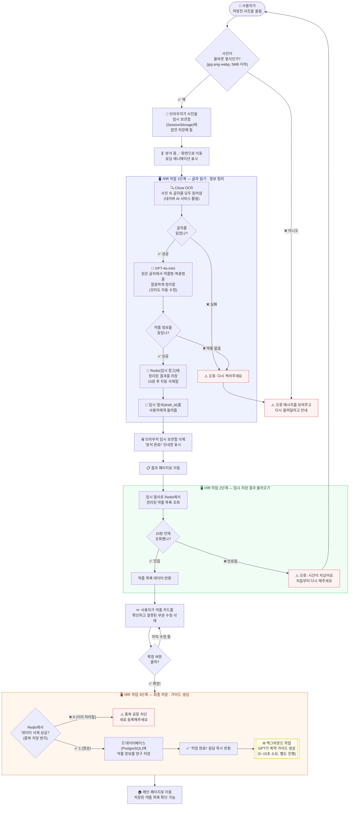
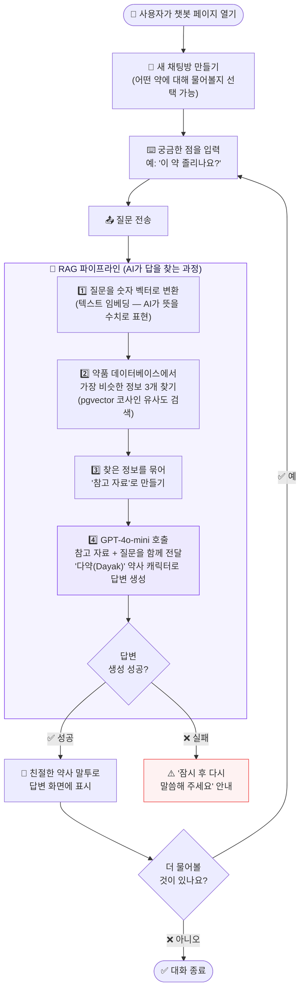

# 처방전 OCR · 챗봇 전체 흐름도

> **읽는 법**: 화살표 방향(→)으로 따라가면 됩니다.  
> 다이아몬드(◇)는 "예/아니오" 질문, 직사각형(□)은 실제로 일어나는 일입니다.

---

## 1. 처방전 사진 → 약 정보 저장 흐름 (OCR)

---

## 2. 챗봇 흐름 (약사 AI와 대화)

---

## 3. RAG 파이프라인 상세 (AI가 정확한 답을 찾는 방법)

> **RAG(검색 증강 생성)란?**  
> AI가 답을 **지어내지 않고**, 실제 약품 데이터베이스에서 **관련 정보를 먼저 찾은 뒤** 그 정보를 바탕으로 대답하는 방식입니다.  
> 마치 의사가 답하기 전에 의학 교과서를 찾아보는 것과 같아요.

```mermaid
flowchart LR
    Q["❓ 사용자 질문<br />예: '타이레놀<br />언제 먹어요?'"]

    subgraph EMBED ["① 질문 이해하기"]
        E1["OpenAI<br />text-embedding-3-small"]
        E2["질문 → 숫자 벡터<br />[0.12, -0.87, 0.34 ...]"]
        E1 --> E2
    end

    subgraph RETRIEVE ["② 관련 정보 찾기"]
        R1["pgvector DB<br />medicine_info 테이블"]
        R2["코사인 유사도로<br />가장 비슷한 약품 정보<br />최대 3개 선택"]
        R3["약품명·효능·<br />부작용·주의사항<br />텍스트로 변환"]
        R1 --> R2 --> R3
    end

    subgraph GENERATE ["③ 답변 만들기"]
        G1["시스템 프롬프트<br />+ 참고 자료<br />+ 사용자 질문"]
        G2["GPT-4o-mini 호출<br />temperature: 0.7"]
        G3["🗣️ 다약(Dayak) 약사<br />말투로 최종 답변 생성<br />(최대 800 토큰)"]
        G1 --> G2 --> G3
    end

    Q --> EMBED
    E2 --> RETRIEVE
    R3 --> GENERATE

    G3 --> A["💬 사용자 화면에<br />답변 표시"]

    style EMBED fill:#eff6ff,stroke:#3b82f6,color:#1e3a8a
    style RETRIEVE fill:#f0fdf4,stroke:#22c55e,color:#14532d
    style GENERATE fill:#fdf4ff,stroke:#a855f7,color:#581c87
```

---

## 단계별 핵심 정리

| 단계 | 무슨 일이 일어나나요? | 사용하는 기술 |
|------|----------------------|--------------|
| **OCR 1단계** | 처방전 사진 → 글자 읽기 → 약품 정보 정리 | Clova OCR + GPT-4o-mini |
| **OCR 2단계** | 정리된 결과를 불러와 사용자가 확인·수정 | Redis (임시 저장소) |
| **OCR 3단계** | 최종 확정 후 DB 저장 + 복약 가이드 생성 | PostgreSQL + GPT-4o-mini |
| **챗봇** | 사용자 질문에 약사 AI가 답변 | RAG + GPT-4o-mini |
| **RAG** | 답하기 전에 실제 약품 DB에서 정보 검색 | OpenAI 임베딩 + pgvector |
