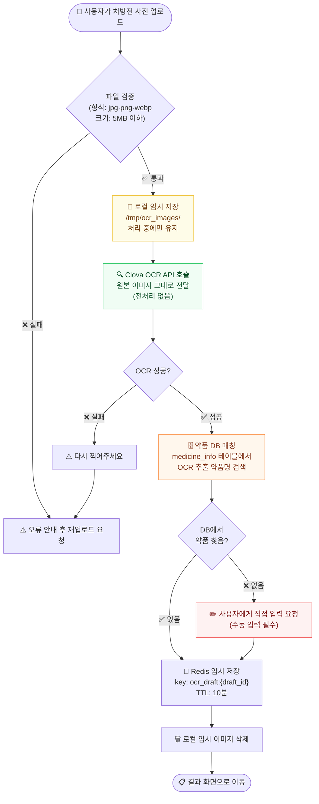
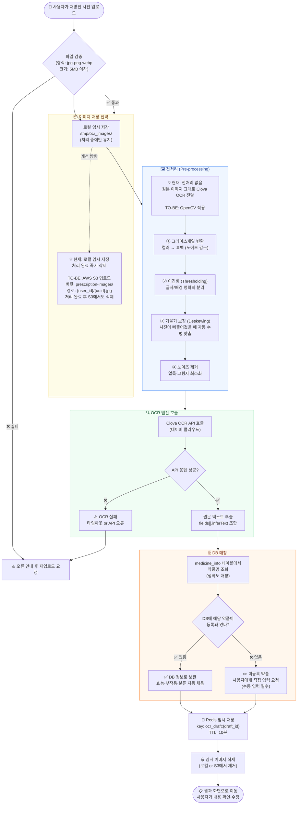
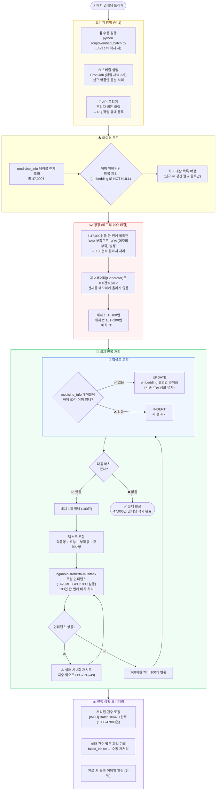
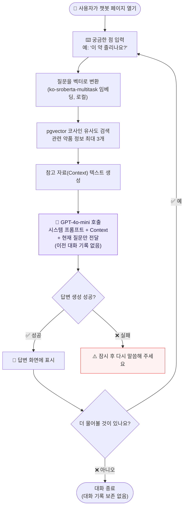
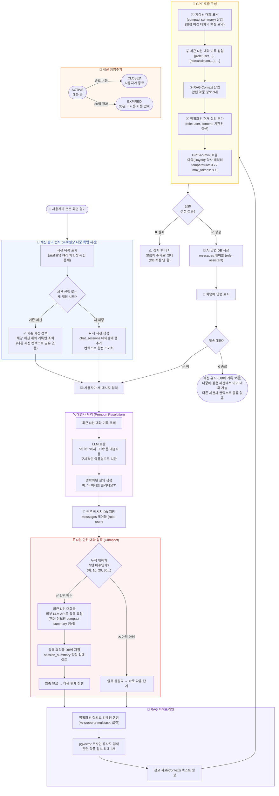

# 심화 플로우차트 (멘토 피드백 반영)

> 기초 플로우차트(`FLOWCHART.md`)와 겹치지 않는 **기술 깊이** 중심 문서입니다.
> 이미지 저장 전략 · 배치 임베딩 · 멀티턴 챗봇 세 가지를 다룹니다.

---

## 목차
1. [OCR 심화 — 이미지 저장·전처리·후처리·DB 매칭](#1-ocr-심화) `AS-IS / TO-BE`
2. [임베딩 배치 — 47,000건 초기 적재 파이프라인](#2-임베딩-배치) `신규 기능`
3. [챗봇 심화 — 멀티턴·컨텍스트 관리·세션 전략](#3-챗봇-심화--멀티턴) `AS-IS / TO-BE`

---

## 1. OCR 심화

### AS-IS

> **현재 상태**: 전처리 없이 원본 이미지를 바로 Clova OCR에 전달, 이미지는 로컬 /tmp에만 임시 저장

**AS-IS 문제점**
- 사진이 어둡거나 기울어진 경우 OCR 인식률 저하
- 서버 재시작 시 /tmp 파일 유실 위험
- DB 매칭 실패 시 사용자가 직접 입력해야 하는 UX 부담

---

### TO-BE

> **읽는 포인트**: 이미지가 어디에 어떻게 저장되는지, 전처리·후처리가 각각 무슨 역할인지 확인하세요.

---

## 2. 임베딩 배치

> **읽는 포인트**: 47,000건을 한 번에 처리하면 메모리가 터집니다. 청킹·제너레이터로 어떻게 나눠 처리하는지 보세요.

---

## 3. 챗봇 심화 — 멀티턴

### AS-IS

> **현재 상태**: 매 질문이 독립적으로 처리됨 — 이전 대화 맥락 없이 RAG + 현재 질문만 GPT에 전달

**AS-IS 문제점**
- "아까 말한 약"처럼 이전 맥락을 참고하는 질문에 대답 불가
- 대화를 닫으면 내용이 사라져 이어서 대화 불가
- 세션 구분이 없어 약별 대화 이력 관리 불가

---

### TO-BE

> **읽는 포인트**: 대화가 쌓일수록 GPT 토큰이 늘어납니다. N턴마다 대화를 압축(compact)해 요약으로 저장하고, 최종 LLM 입력은 "요약 + 최근 N턴 + 사용자 질의 + RAG"로 구성합니다.

---

## 핵심 기술 포인트 요약

| 구분 | 핵심 결정 사항 | 이유 |
|------|--------------|------|
| **OCR 이미지 저장** | 로컬 임시 → TO-BE: S3 | 서버 재시작 시 파일 유실 방지 |
| **OCR 전처리** | 현재 없음 → TO-BE: OpenCV | 사진 품질이 낮을 때 인식률 향상 |
| **OCR 후처리** | LLM 없음 → DB 직접 매칭 | 비용 절감; 미매칭 시 사용자 직접 입력 |
| **임베딩 모델** | jhgan/ko-sroberta-multitask (로컬, ~420MB, 768차원) | OpenAI API 비용 없음, 한국어 특화 |
| **배치 청킹** | 100건 단위 제너레이터 | 47,000건 한 번에 올리면 OOM 발생 |
| **임베딩 업설트** | INSERT or UPDATE 분기 | 중복 삽입 방지 + 기존 데이터 보존 |
| **대명사 처리** | LLM으로 질의 내 대명사 → 구체 약품명 치환 | "이 약", "아까 그 약" 등 맥락 이해 |
| **멀티턴 압축** | N턴마다 LLM으로 compact summary 생성 → DB 저장 | 오래된 대화를 요약해 토큰 한도 관리 |
| **최종 LLM 입력** | 요약 + 최근 N턴 + 사용자 질의 + RAG | 짧은 토큰으로 긴 대화 맥락 유지 |
| **세션 관리** | 프로필당 다중 독립 세션, DB 영구 저장 + 30일 만료 | 세션 간 컨텍스트 공유 없음; 앱 종료 후 이어가기 가능 |
