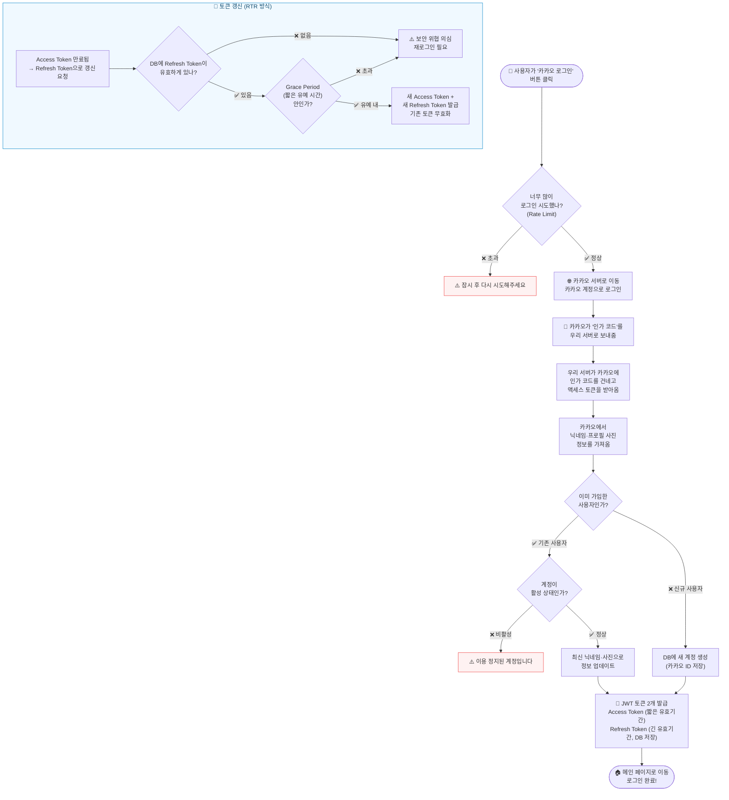
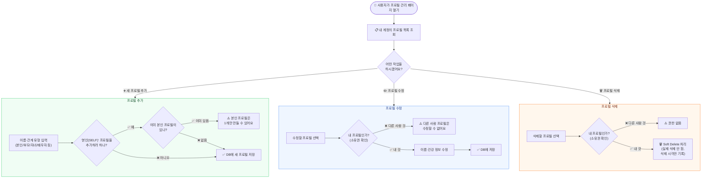
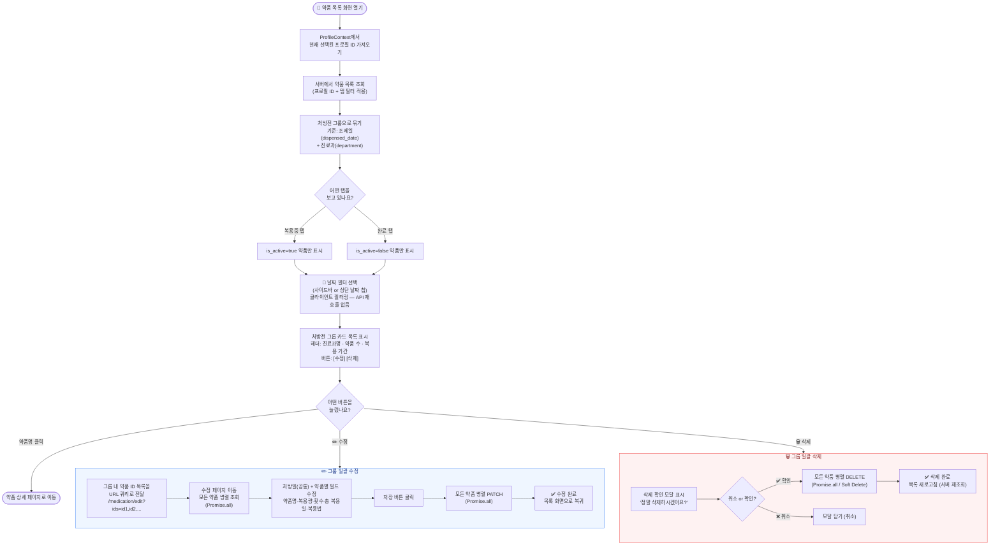

# 기능별 흐름도 (AS-IS / TO-BE)

> **AS-IS**: 현재 코드가 동작하는 방식  
> **TO-BE**: 수정·개선 후 동작 방식 (수정 완료 시 업데이트)

---

## 목차
1. [로그인 (OAuth)](#1-로그인-oauth)
2. [프로필 관리](#2-프로필-관리)
3. [처방전(약품) 수정·삭제](#3-처방전약품-수정삭제)
4. [복약 기록](#4-복약-기록)
5. [챌린지](#5-챌린지)

---

## 1. 로그인 (OAuth)

### AS-IS



### TO-BE

> 수정 후 이 칸을 채워주세요.

---

## 2. 프로필 관리

### AS-IS



### TO-BE

> 수정 후 이 칸을 채워주세요.

---

## 3. 처방전(약품) 수정·삭제

### AS-IS

```mermaid
flowchart TD
    START(["👤 저장된 약품 목록 화면"))

    START --> LIST["💊 내 프로필의 약품 목록 조회<br />(활성/완료 필터 선택 가능)"]
    LIST --> SELECT["약품 카드 선택"]
    SELECT --> DETAIL["약품 상세 보기<br />(약품명·복용법·날짜 등)"]

    DETAIL --> ACTION{"어떤 작업을<br />하시겠어요?"}

    ACTION -- "✏️ 수정" --> EDIT_FLOW
    ACTION -- "🗑️ 삭제" --> DELETE_FLOW
    ACTION -- "⛔ 복용 중단" --> DEACTIVATE_FLOW
    ACTION -- "ℹ️ 약품 정보 보기" --> INFO_FLOW

    subgraph EDIT_FLOW ["약품 수정"]
        E1{"내 약품인가?<br />(소유권 확인)"}
        E2["⚠️ 권한 없음"]
        E3["수정할 내용 입력<br />(복용량·횟수·날짜 등)"]
        E4["✅ DB에 업데이트"]

        E1 -- "❌" --> E2
        E1 -- "✅" --> E3
        E3 --> E4
    end

    subgraph DELETE_FLOW ["약품 삭제"]
        D1{"내 약품인가?<br />(소유권 확인)"}
        D2["⚠️ 권한 없음"]
        D3["🗑️ Soft Delete 처리<br />(삭제 시각 기록)"]

        D1 -- "❌" --> D2
        D1 -- "✅" --> D3
    end

    subgraph DEACTIVATE_FLOW ["복용 중단"]
        A1["is_active = False 로 변경<br />(완료 약품으로 이동)"]
    end

    subgraph INFO_FLOW ["약품 정보 조회 (LLM + 캐시)"]
        I1{"DB 캐시에<br />같은 약품 정보가<br />있나? (30일 유효)"}
        I2["💾 캐시에서 바로 반환<br />(API 비용 절감)"]
        I3["🤖 GPT-4o-mini 호출<br />주의사항·부작용·상호작용 생성"]
        I4["결과를 DB에 캐시 저장<br />(30일 보관)"]
        I5["약품 정보 화면에 표시"]

        I1 -- "✅ 있음 (캐시 히트)" --> I2
        I1 -- "❌ 없음 (캐시 미스)" --> I3
        I3 --> I4
        I4 --> I5
        I2 --> I5
    end

    style EDIT_FLOW fill:#eff6ff,stroke:#3b82f6,color:#1e3a8a
    style DELETE_FLOW fill:#fef2f2,stroke:#ef4444,color:#7f1d1d
    style DEACTIVATE_FLOW fill:#fff7ed,stroke:#f97316,color:#7c2d12
    style INFO_FLOW fill:#f5f3ff,stroke:#7c3aed,color:#581c87
```

### TO-BE

> **변경 핵심**: 개별 약품 단위 → **처방전 그룹 단위** 일괄 수정·삭제로 변경



**AS-IS vs TO-BE 핵심 차이**

| 항목 | AS-IS | TO-BE |
|------|-------|-------|
| 수정·삭제 단위 | 개별 약품 1개 | 처방전 그룹 전체 |
| 수정 진입 방법 | 약품 상세 → 수정 버튼 | 목록 그룹 헤더 → 수정 버튼 |
| 처방일 수정 | 약품마다 개별 입력 | 처방일 1개 → 그룹 전체 공통 적용 |
| 삭제 방식 | 상세 페이지에서 단건 삭제 | 목록에서 확인 모달 → 그룹 일괄 삭제 |
| API 호출 방식 | 단건 PATCH / DELETE | Promise.all 병렬 요청 |
| 날짜 필터 | 없음 | 사이드바 + 날짜 칩 (클라이언트 필터) |

---

## 4. 복약 기록

### AS-IS

```mermaid
flowchart TD
    START(["👤 오늘 복약 기록 화면"))

    START --> TODAY["📅 오늘 날짜의<br />복용 기록 목록 조회<br />(SCHEDULED 상태)"]

    TODAY --> LOG_ITEM["복용 기록 항목 선택<br />(약품명·예정 시각 표시)"]

    LOG_ITEM --> ACTION{"어떤 작업을<br />하시겠어요?"}

    ACTION -- "✅ 먹었어요" --> TAKEN_FLOW
    ACTION -- "⏭️ 건너뛸게요" --> SKIP_FLOW
    ACTION -- "🗑️ 기록 삭제" --> DELETE_FLOW

    subgraph TAKEN_FLOW ["복용 완료 처리"]
        T1{"내 기록인가?<br />(소유권 확인)"}
        T2["⚠️ 권한 없음"]
        T3{"이미 처리된<br />기록인가?"}
        T4["⚠️ 이미 처리된<br />복용 기록입니다"]
        T5["✅ 상태를 TAKEN으로 변경<br />복용 시각 기록"]

        T1 -- "❌" --> T2
        T1 -- "✅" --> T3
        T3 -- "❌ SCHEDULED 아님" --> T4
        T3 -- "✅ SCHEDULED" --> T5
    end

    subgraph SKIP_FLOW ["복용 건너뜀 처리"]
        S1{"내 기록인가?<br />(소유권 확인)"}
        S2["⚠️ 권한 없음"]
        S3{"이미 처리된<br />기록인가?"}
        S4["⚠️ 이미 처리된<br />복용 기록입니다"]
        S5["⏭️ 상태를 SKIPPED로 변경"]

        S1 -- "❌" --> S2
        S1 -- "✅" --> S3
        S3 -- "❌ SCHEDULED 아님" --> S4
        S3 -- "✅ SCHEDULED" --> S5
    end

    subgraph DELETE_FLOW ["복용 기록 삭제"]
        D1{"내 기록인가?<br />(소유권 확인)"}
        D2["⚠️ 권한 없음"]
        D3["🗑️ Hard Delete<br />(DB에서 완전히 삭제)"]

        D1 -- "❌" --> D2
        D1 -- "✅" --> D3
    end

    subgraph STREAK ["🔥 연속 복용일 계산"]
        direction LR
        SR1["오늘 TAKEN 기록이<br />있으면 오늘부터 거꾸로 셈"]
        SR2["없으면 어제부터 거꾸로 셈"]
        SR3["TAKEN 있는 날이<br />연속으로 몇 일인지 계산"]
        SR4["연속 복용일 숫자 표시<br />예: 🔥 7일 연속"]

        SR1 --> SR3
        SR2 --> SR3
        SR3 --> SR4
    end

    TODAY --> STREAK

    style TAKEN_FLOW fill:#f0fdf4,stroke:#22c55e,color:#14532d
    style SKIP_FLOW fill:#fff7ed,stroke:#f97316,color:#7c2d12
    style DELETE_FLOW fill:#fef2f2,stroke:#ef4444,color:#7f1d1d
    style STREAK fill:#fefce8,stroke:#eab308,color:#713f12
```

### TO-BE

> 수정 완료 후 이 칸을 채워주세요.

---

## 5. 챌린지

### AS-IS

```mermaid
flowchart TD
    START(["👤 챌린지 화면"))

    START --> LIST["🏆 내 프로필의<br />챌린지 목록 조회"]
    LIST --> FILTER{"어떤 챌린지를<br />볼까요?"}
    FILTER -- "진행 중만" --> ACTIVE_LIST["활성(IN_PROGRESS) 챌린지만 표시"]
    FILTER -- "전체" --> ALL_LIST["전체 챌린지 표시"]

    ACTIVE_LIST --> SELECT
    ALL_LIST --> SELECT
    SELECT["챌린지 선택"] --> ACTION{"어떤 작업을<br />하시겠어요?"}

    ACTION -- "➕ 새 챌린지 만들기" --> CREATE_FLOW
    ACTION -- "✅ 오늘 완료했어요" --> COMPLETE_FLOW
    ACTION -- "✏️ 수정" --> EDIT_FLOW
    ACTION -- "🗑️ 삭제" --> DELETE_FLOW

    subgraph CREATE_FLOW ["챌린지 생성"]
        C1["제목·설명·목표 일수·난이도 입력"]
        C2{"내 프로필인가?<br />(소유권 확인)"}
        C3["⚠️ 권한 없음"]
        C4["✅ DB에 챌린지 저장<br />상태: IN_PROGRESS<br />시작일: 오늘"]

        C1 --> C2
        C2 -- "❌" --> C3
        C2 -- "✅" --> C4
    end

    subgraph COMPLETE_FLOW ["오늘 완료 처리"]
        D1["오늘 날짜를<br />completed_dates 목록에 추가<br />(중복이면 무시)"]
        D2{"완료 일수 ≥<br />목표 일수?"}
        D3["🎉 상태를 COMPLETED로 변경<br />챌린지 달성!"]
        D4["계속 진행 중<br />IN_PROGRESS 유지"]

        D1 --> D2
        D2 -- "✅ 달성!" --> D3
        D2 -- "❌ 아직" --> D4
    end

    subgraph EDIT_FLOW ["챌린지 수정"]
        E1{"내 챌린지인가?<br />(소유권 확인)"}
        E2["⚠️ 권한 없음"]
        E3["제목·설명·목표 일수 수정"]
        E4["✅ DB에 저장"]

        E1 -- "❌" --> E2
        E1 -- "✅" --> E3
        E3 --> E4
    end

    subgraph DELETE_FLOW ["챌린지 삭제"]
        DL1{"내 챌린지인가?<br />(소유권 확인)"}
        DL2["⚠️ 권한 없음"]
        DL3["🗑️ Soft Delete<br />(삭제 시각 기록)"]

        DL1 -- "❌" --> DL2
        DL1 -- "✅" --> DL3
    end

    subgraph STATUS ["챌린지 상태 변화"]
        direction LR
        ST1(["IN_PROGRESS<br />진행 중"])
        ST2(["COMPLETED<br />달성 완료"])
        ST3(["ABANDONED<br />포기"])

        ST1 -- "목표 일수 달성" --> ST2
        ST1 -- "포기 처리" --> ST3
    end

    style CREATE_FLOW fill:#f0fdf4,stroke:#22c55e,color:#14532d
    style COMPLETE_FLOW fill:#fefce8,stroke:#eab308,color:#713f12
    style EDIT_FLOW fill:#eff6ff,stroke:#3b82f6,color:#1e3a8a
    style DELETE_FLOW fill:#fef2f2,stroke:#ef4444,color:#7f1d1d
    style STATUS fill:#f5f3ff,stroke:#7c3aed,color:#581c87
```

### TO-BE

> 수정 완료 후 이 칸을 채워주세요.

---

## 변경 이력

| 날짜 | 기능 | 변경 내용 |
|------|------|----------|
| - | - | AS-IS 최초 작성 |
