# RAG 파이프라인 데이터 흐름

> **범위**: 사용자 질의 입력 → 최종 응답까지의 전체 파이프라인.
> **PR**: `feature/RAG` (2026-05-02). 본 문서는 5-1 시나리오 (`"타이레놀 먹어도 돼?"`) 를 기준으로 한다.
> **연관 문서**: `PLAN.md`, `app/CLAUDE.md`, `ai_worker/CLAUDE.md`

---

## 1. 전체 파이프라인 Mermaid Flowchart

```mermaid
flowchart TD
    %% ── 입력 ──
    U([User: '타이레놀 먹어도 돼?']):::user --> R[POST /chat/ask]
    R --> MS[MessageService.ask_with_tools]

    %% ── Step 0: 컨텍스트 로더 ──
    MS --> CTX_HEAD[/Step 0 — Context Loader/]:::stepHead
    CTX_HEAD --> SURVEY[(profiles.health_survey)]
    CTX_HEAD --> MEDS[(medication 테이블)]
    CTX_HEAD --> HIST[(recent ChatMessages)]
    CTX_HEAD --> SUMMARY[(chat_sessions.summary)]
    SURVEY --> CTX_BUILD
    MEDS --> CTX_BUILD
    HIST --> CTX_BUILD
    SUMMARY --> CTX_BUILD
    CTX_BUILD[medical_context.build<br/>+ history 정렬<br/>+ summary 추출]

    %% ── Step 1: Fastpath ──
    CTX_BUILD --> FP_HEAD[/Step 1 — Fastpath/]:::stepHead
    FP_HEAD --> FP{단순 인사·욕설·도메인외?}
    FP -->|YES — 4o-mini direct_answer| DIRECT[즉시 응답]:::terminal
    FP -->|NO — 도메인 질문| INTENT_HEAD

    %% ── Step 2: Intent + Rewrite + Fan-out ──
    INTENT_HEAD[/Step 2 — IntentClassifier 4o-mini/]:::stepHead
    INTENT_HEAD --> INTENT[Structured Output<br/>response_format=Pydantic]
    INTENT --> FANOUT[fan-out queries 생성 cap=10<br/>음성응답 제외 / 임상 우선순위 자율 cut<br/>referent_resolution 동시 산출]

    %% ── Step 3: Retrieval ──
    FANOUT --> RET_HEAD[/Step 3 — Retrieval/]:::stepHead
    RET_HEAD --> EMB[OpenAI Embedding batch<br/>text-embedding-3-large 3072d]
    EMB --> PARALLEL{각 query 병렬 실행<br/>asyncio.gather}
    PARALLEL --> VEC[pgvector cosine top-K=5]
    PARALLEL --> BM25[tsvector BM25 top-K=5]
    VEC --> RRF1[1차 RRF intra-query<br/>vector ↔ BM25 병합]
    BM25 --> RRF1
    RRF1 --> RRF2[2차 RRF cross-query<br/>final_cap=15 unique chunks]

    %% ── Step 4: Prompt 조립 ──
    RRF2 --> ASSEM_HEAD[/Step 4 — Prompt 조립/]:::stepHead
    ASSEM_HEAD --> SYS[system prompt 조립]
    ASSEM_HEAD --> USR[user prompt 조립]

    SYS --> SYS_PARTS[<b>system</b><br/>1. persona<br/>2. output format rule<br/>3. 의학 컨텍스트 medication+survey<br/>4. session summary<br/>5. 명확화 referent_resolution 있을 때만<br/>6. RAG context inject 마지막]
    USR --> USR_PARTS[<b>user / assistant / tool</b><br/>recent history 3+3=6 messages<br/>현재 사용자 turn raw query<br/>tool_calls + tool results]

    %% ── Step 5: 2nd LLM ──
    SYS_PARTS --> LLM_HEAD[/Step 5 — 2nd LLM 4o/]:::stepHead
    USR_PARTS --> LLM_HEAD
    LLM_HEAD --> LLM[OpenAI Chat Completion]
    LLM --> ANS[assistant 답변 생성]

    %% ── 영속화 ──
    ANS --> PERSIST[(chat_messages INSERT)]
    DIRECT --> PERSIST
    PERSIST -->|N turn 마다| COMPACT[/RQ: compact_and_save_session_job/]:::async
    PERSIST --> RESP([HTTP 200 → User]):::user

    %% ── 스타일 ──
    classDef stepHead fill:#fde68a,stroke:#f59e0b,stroke-width:2px,color:#000
    classDef user fill:#bfdbfe,stroke:#3b82f6,stroke-width:2px,color:#000
    classDef terminal fill:#fecaca,stroke:#dc2626,stroke-width:2px,color:#000
    classDef async fill:#d1fae5,stroke:#059669,color:#000
```



### 범례
| 색 | 의미 |
|---|---|
| 노랑 | Step 헤더 |
| 파랑 | 사용자 입출력 |
| 빨강 | Fastpath 직답 종료 (Step 1 에서 끝나는 케이스) |
| 초록 | 비동기 background 작업 |

---

## 2. 4o 모델의 system prompt vs user prompt 배치 분석

OpenAI Chat Completion API 의 message 구조에서 어떤 정보를 어디에 두느냐는 **답변 품질·일관성·재사용성** 에 직접 영향. 항목별로 분석한다.

### 2.1 OpenAI 의 메시지 역할 정의 (2024-2025 공식 가이드)

| role | 의도 | 우선순위 | 특성 |
|---|---|---|---|
| `system` | 모델의 **행동 규칙·페르소나·제약** 지시 | 가장 강함 | 한 번 설정하면 turn 내내 적용. 명령 톤 |
| `user` | 사용자의 **의도/질의 데이터** | 중간 | 매 turn 변동. 자연어 |
| `assistant` | 이전 답변 회상 | 낮음 | 재사용 가능하나 임의 수정 X |
| `tool` | tool 호출 결과 | tool_call 페어링 | 컨텍스트로만 작동 |

**핵심 룰** (OpenAI Cookbook 2024-12):
- **불변 규칙·페르소나·포맷 강제**: system
- **변동 데이터·사용자 의도**: user
- **검색 결과 (RAG)**: 양쪽 다 가능 — 답변의 근거인지(user) vs 행동 강제인지(system) 로 결정

---

### 2.2 항목별 배치 분석

#### A. 페르소나 ("Dayak 약사 챗봇, 따뜻한 어조") — **system** ★ 명확

| 근거 | 내용 |
|---|---|
| 변동성 | 0% (불변) |
| 강제 필요성 | 매우 높음 (LLM 이 turn 중간에 어조 바꾸면 일관성 깨짐) |
| 결정 | **system** — `[persona]` 섹션 |

#### B. Output 포맷 룰 ("한국어 GFM, 코드블록 X, 출처 명시") — **system** ★ 명확

| 근거 | 내용 |
|---|---|
| 변동성 | 0% (불변) |
| 강제 필요성 | 매우 높음 (포맷 일관성은 사용자 경험 직결) |
| 결정 | **system** — `[output rule]` 섹션 |

#### C. 의학 컨텍스트 (medication + health_survey) — **system** ★ 강력 추천

| 근거 | 내용 |
|---|---|
| 변동성 | 사용자별로 다름. 한 turn 안에서는 불변 |
| 역할 | "이 사용자는 와파린 복용 중이며 페니실린 알레르기" — **사실 (fact)** |
| user 에 두면 | LLM 이 사용자 발화 자체로 오해 가능. "와파린 복용 중인데..." 가 user 발화에 들어가면 LLM 이 "그건 알겠고 질문이 뭐야?" 식 응답 위험 |
| system 에 두면 | LLM 이 컨텍스트로 인식 → 모든 답변에 자동 반영 |
| 외부 best | OpenAI Cookbook RAG 가이드 — "User profile/persona context goes in system" |
| 결정 | **system** — `[사용자 의학 컨텍스트]` 섹션 |

#### D. 세션 요약 (chat_sessions.summary) — **system** ⭐ 추천

| 근거 | 내용 |
|---|---|
| 변동성 | 6 turn 마다 갱신, 한 turn 안에서는 불변 |
| 역할 | "이전 대화에서 사용자가 메트포민 부작용 문의" — **이력 사실** |
| user 에 두면 | C 와 동일한 혼동 위험 |
| system 에 두면 | 누적 맥락이 행동 규칙 옆에 위치 → LLM 이 "이전 컨텍스트 + 페르소나" 통합 반응 |
| 결정 | **system** — `[세션 요약]` 섹션 (의학 컨텍스트 바로 아래) |

#### E. RAG context inject (`[약: 타이레놀][section]: ...`) — **system** ⭐ 추천

| 근거 | 내용 |
|---|---|
| 변동성 | 매 turn 변동 (검색 결과) |
| 역할 | "답변의 근거 자료" — **참고할 fact** |
| 두 가지 학파 | (1) user 에 "다음 자료를 참고해서 답변" + RAG (2) system 에 직접 inject |
| (1) 의 단점 | RAG 텍스트가 사용자 발화처럼 보여 LLM 이 "그래서 질문이 뭐야?" 식 응답 위험. 또한 사용자 turn 직전에 가야 하므로 history 위치 제약 |
| (2) 의 장점 | "이 자료를 근거로 답하라" 행동 강제. user turn 은 **순수 질문** 만 유지 → LLM 이 질문/근거 명확히 분리 |
| 외부 best | Anthropic + OpenAI RAG 가이드 모두 (2) 권장. Anthropic 의 "long context tip" — 출처 자료는 system 또는 user 시작부에 위치하면 lost-in-the-middle 회피 |
| 결정 | **system** — `[검색된 약품 정보]` 섹션 (가장 마지막) |

#### F. Recent history (6 messages = 3 user + 3 assistant) — **user/assistant 각자** ★ 명확

| 근거 | 내용 |
|---|---|
| 변동성 | 매 turn 변동 |
| 역할 | 실제 user/assistant 대화 — **재현이 의미 있음** |
| 길이 | 6 messages — 6 turn 마다 compact 하므로 그 이전은 summary 가 흡수 |
| system 에 두면 | LLM 이 "system 이 가짜 대화를 만들었다" 로 받아들임. 실제 대화 흐름 재현 X |
| user/assistant 분리 | OpenAI API 의 의도된 사용법. messages list 에 role 별로 배치 |
| 결정 | **각 turn 의 role 그대로 6 messages** |

#### G. 현재 사용자 turn — **user** ★ 명확

| 근거 | 내용 |
|---|---|
| 변동성 | 매 turn |
| 역할 | 사용자의 진짜 질의 |
| 결정 | **user** — messages 의 마지막 |

#### H. tool_calls + tool results (history 의 일부) — **assistant + tool**

| 근거 | 내용 |
|---|---|
| 역할 | OpenAI tool calling 표준 흐름 |
| 결정 | **assistant** role 에 `tool_calls` 필드 + 결과는 `{"role": "tool", "tool_call_id": ..., "content": ...}` (현재 코드 그대로) |

#### I. fanout_queries (4o-mini 가 생성한 fan-out 쿼리들) — **user 에도 system 에도 두지 않음** ⭐ 중요

| 근거 | 내용 |
|---|---|
| 역할 | retrieval 단계의 **검색 키워드** — LLM 이 답변 생성 시 볼 필요 없음 |
| 두 가지 함정 | (1) user 에 두면 LLM 이 "이 7개 query 에 답해" 로 오해. 사용자 의도가 흐려짐 (2) system 에 두면 행동 규칙으로 작용해 답변이 query 별 항목식이 됨 |
| 결정 | **포함 안함** — retrieval 단계의 내부 부산물. 답변 생성 단계엔 RAG **결과만** 들어감 |
| 단, intent 디버깅 | metadata 로 `messages.metadata.fanout_queries` 에 별도 저장 |

#### J. referent_resolution (대명사 → 명사 매핑) — **system [명확화] 섹션** ⭐ 신규

| 근거 | 내용 |
|---|---|
| 변동성 | 매 turn 변동 (history 의존) |
| 역할 | 사용자가 "그거" 라고 말했을 때 LLM 이 referent 추적 부담 ↓ |
| user 에 두면 | raw query 가 그대로 보존되지 않음 (canonical 폐기 결정) |
| system 에 두면 | LLM 이 답변 생성 시 referent 명확. 매 turn 추적 비용 절감 |
| 형식 | `[명확화]\n- '그거' → '타이레놀'\n- '거기' → '강남역'` |
| 결정 | **system — 5번째 섹션** (referent_resolution 가 None 이면 섹션 생략) |
| 검증 룰 | history 에 명시된 약 이름만 referent 로 인정 (hallucination 방지) |

#### K. canonical_query — **도입 안함** (직전 결정 정정)

| 근거 | 내용 |
|---|---|
| 폐기 사유 ① | DB ↔ LLM 의 user content 가 다름 → 디버깅 복잡, 팀원 학습 비용 |
| 폐기 사유 ② | history 가 6 messages 로 짧아 multi-turn 일관성은 다른 메커니즘 (summary) 이 흡수 |
| 폐기 사유 ③ | canonical 의 formal 톤이 "Dayak 약사 — 따뜻한 해요체" 페르소나를 깨뜨릴 위험 |
| 폐기 사유 ④ | 대명사 풀이의 핵심 가치는 referent_resolution 으로 더 작은 메커니즘으로 해결 |
| 폐기 사유 ⑤ | system 의 [의학 컨텍스트] 와 의미 중복 → token 낭비 |
| 결정 | **2nd LLM user role 은 raw query 그대로** |

---

### 2.3 최종 prompt 구조 (확정안)

```python
messages = [
    {
        "role": "system",
        "content": (
            # ── 1. 페르소나 ──
            "[persona]\n"
            "당신은 'Dayak' 약사 챗봇입니다. 따뜻한 해요체로 답변하세요...\n\n"

            # ── 2. 출력 포맷 룰 ──
            "[output rule]\n"
            "- 한국어 GFM\n"
            "- 코드블록 금지\n"
            "- 출처: [약: 약품명] [섹션] 인라인 표기\n\n"

            # ── 3. 사용자 의학 컨텍스트 ──
            "[사용자 의학 컨텍스트]\n"
            "복용 중인 약: 메트포민, 와파린, 오메가3\n"
            "기저질환: 당뇨, 고혈압\n"
            "알레르기: 페니실린\n"
            "흡연: 비흡연 / 음주: 비음주 / 임신: 해당없음\n\n"

            # ── 4. 세션 요약 ──
            "[세션 요약]\n"
            "{chat_sessions.summary}\n\n"

            # ── 5. 명확화 (referent_resolution 있을 때만) ──
            "[명확화]\n"
            "- '그거' → '타이레놀'\n\n"

            # ── 6. RAG 검색 결과 (가장 마지막, lost-in-middle 회피) ──
            "[검색된 약품 정보]\n"
            "[약: 타이레놀] [drug_interaction]: 타이레놀(아세트아미노펜)을 와파린과 함께 복용 시 INR 상승...\n"
            "[약: 와파린] [drug_interaction]: 와파린은 아세트아미노펜과 병용 시 출혈 위험 증가...\n"
            "[약: 타이레놀] [adverse_reaction]: 흔한 부작용은 오심...\n"
            "...\n"
        ),
    },
    # ── recent history 6 messages (3 user + 3 assistant) ──
    {"role": "user", "content": "이전 turn 1 raw"},
    {"role": "assistant", "content": "이전 답변 1"},
    {"role": "user", "content": "이전 turn 2 raw"},
    {"role": "assistant", "content": "이전 답변 2"},
    {"role": "user", "content": "이전 turn 3 raw"},
    {"role": "assistant", "content": "이전 답변 3"},
    # ── 현재 사용자 turn (raw query 그대로, canonical 도입 안함) ──
    {"role": "user", "content": "그거 먹어도 돼?"},
    # ── tool calling 흐름 (4o 의 1차 응답 + tool 결과) ──
    {"role": "assistant", "content": None, "tool_calls": [...]},
    {"role": "tool", "tool_call_id": "...", "content": "{...chunks...}"},
]
```

### 2.4 system 안의 섹션 순서

OpenAI/Anthropic 의 long context 분석에서 도출된 **권장 순서** (lost-in-middle 회피):

```
1. persona               (가장 행동 결정적)
2. output rule           (포맷 강제)
3. 사용자 의학 컨텍스트   (이 turn 의 핵심 사실)
4. 세션 요약             (긴 이력 압축)
5. 명확화                (referent_resolution 있을 때만, 없으면 섹션 자체 생략)
6. RAG 검색 결과         ★ 가장 마지막 — LLM 이 답변 직전에 본 자료를 가장 잘 사용
```

**왜 RAG 가 마지막?**
- "Lost in the middle" (Liu et al. 2023) — 긴 system prompt 의 **앞과 뒤** 가 가장 잘 회상됨
- RAG 는 답변의 근거이므로 **답변 직전 (system 의 마지막) 위치** 가 최적

**왜 명확화가 RAG 바로 앞?**
- LLM 이 RAG context 를 처리할 때 referent 가 이미 풀려있어야 chunk 의 약 이름과 매칭 가능
- "그거" 가 안 풀린 채 RAG 에 들어가면 LLM 이 chunk 의 어떤 약이 referent 인지 추측해야 함

---

## 3. user prompt 의 messages list 구조

system 은 한 덩어리지만, user/assistant role 은 **여러 message** 로 펼쳐진다.

```
messages
├─ system                     (한 덩어리, 위 §2.3, 6개 섹션)
├─ user (history -3)          ← 6 turn compact 의 비요약 구간
├─ assistant (history -3)
├─ user (history -2)
├─ assistant (history -2)
├─ user (history -1)
├─ assistant (history -1)
├─ user (현재 turn, raw query) ★ 답변 대상
├─ assistant (tool_calls)     ★ tool 호출 발행
└─ tool (tool_call_id)        ★ retrieval 결과 페어링
```

**왜 history 를 system 으로 합치지 않나?**
- OpenAI 의 학습은 user/assistant 시간순 turn 패턴 위에 이루어짐 → role 분리가 자연스러운 입력
- system 으로 합치면 LLM 이 "system 의 가짜 대화" 로 받아들여 회상률 ↓

---

## 4. 요약 — 어디에 두냐 결정 표

| 항목 | system | user | assistant | tool | 비고 |
|---|---|---|---|---|---|
| persona | ✅ | | | | 불변 룰 |
| output 포맷 룰 | ✅ | | | | 불변 룰 |
| 의학 컨텍스트 (medication + survey) | ✅ | | | | 사용자별 fact |
| 세션 요약 | ✅ | | | | 누적 맥락 |
| RAG context inject | ✅ | | | | 답변 근거, system 마지막 위치 |
| recent history | | ✅ | ✅ | | role 분리 |
| 현재 사용자 turn | | ✅ | | | messages 마지막 user |
| tool_calls (assistant 발행) | | | ✅ | | OpenAI 표준 |
| tool results | | | | ✅ | tool_call_id 페어링 |
| rewritten_queries | ❌ | ❌ | | | 답변 생성 단계엔 노출 X. metadata JSON 저장 |

---

## 5. Anti-pattern (피해야 할 것)

### Anti-pattern 1: RAG 를 user 에 두기
```python
# ❌ BAD
{"role": "user", "content": f"다음 자료 참고해서 답해: {chunks}\n\n질문: 타이레놀 먹어도 돼?"}
```
- LLM 이 사용자 의도 (질문) 와 자료 (chunks) 를 분리하기 어려움
- 답변 톤이 "분석하라" 식으로 변질 가능

### Anti-pattern 2: history 를 system 으로 합치기
```python
# ❌ BAD
{"role": "system", "content": "이전 대화: USER: ... ASSISTANT: ... USER: ..."}
```
- OpenAI 의 turn 패턴 학습 무효화
- 회상률 저하

### Anti-pattern 3: 의학 컨텍스트를 user turn 에 inject
```python
# ❌ BAD
{"role": "user", "content": "[복용 중: 와파린, 메트포민] 타이레놀 먹어도 돼?"}
```
- 사용자가 매번 입력한 것처럼 보임 → 모델이 "왜 똑같은 정보 반복해?" 식 응답 위험
- 사용자 정보가 LLM context 에 명확히 fact 로 마크 안 됨

---

## 6. 참고

- **OpenAI Cookbook — RAG with Chat Completions** (2024-12)
- **OpenAI Structured Outputs** (2024-08, response_format)
- **Anthropic — Long context tips** (2024-09, lost-in-middle 회피)
- **Liu et al., "Lost in the Middle" (2023)** — 긴 컨텍스트의 위치 회상률 분석
- **Cormack, Clarke, Buettcher — RRF (2009)** — k=60 표준
