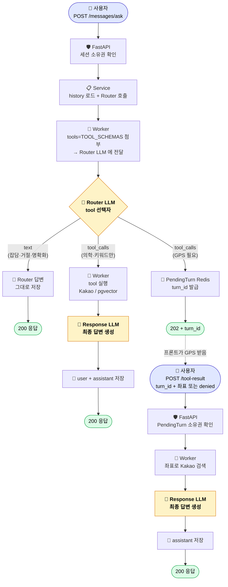

# Dayak 챗봇 백엔드 흐름

> 옵션 C (RAG-as-tool) 적용 후의 챗봇 한 턴 처리 흐름 정리.
> 작성: 2026-04-27. 대상 독자: 백엔드/풀스택 개발자, 신규 합류자.

---

## 0. 한 줄 요약

`POST /messages/ask` 에 사용자 입력이 들어오면 **Router LLM** 이 도구
선택으로 의도를 분류하고, 분기에 따라 (직답 / tool 실행 + 답변 / GPS 파킹)
처리한다. **LLM 호출은 한 턴 최대 2회** (Router + Response).

---

## 1. 전체 흐름 (위에서 아래로)



### 도식 규칙

- 화살표는 항상 **위 → 아래** 단방향 (왔다갔다 핑퐁 없음).
- 🟡 **노란색** = LLM 호출 (한 턴 최대 2번).
- 🟢 **초록색** = HTTP 응답 종료점.
- 🟣 **보라색** = 사용자 / 클라이언트 입력 진입점.
- 분기는 **Router LLM 결과에서 3 갈래**로만 갈라지고 다시 합치지 않는다.

---

## 2. 책임 한 줄 요약

| 누가 | 무엇을 |
|-----|------|
| 🛡️ FastAPI | 권한만 (세션 / PendingTurn 소유권) |
| 📋 Service (`MessageService`) | 흐름 분기 결정 (text / eager / geo / pending) |
| 🤖 AI Worker | Tool schemas 전달 + tool 실제 실행 |
| 🧠 Router LLM (gpt-4o-mini) | **어떤 tool 을 어떤 인자로 호출할지 선택** |
| 🧠 Response LLM (gpt-4o-mini) | tool 결과를 받아 최종 한국어 답변 작성 |

---

## 3. 단계별 상세

### 3.1 진입 단계

| 위치 | 행동 |
|------|------|
| `app/apis/v1/message_routers.py::ask_message` | 요청 진입, DI 로 `MessageService` 주입 |
| `MessageService._verify_session_ownership` | DB 의 `chat_session.account_id` == 현재 account 비교 |
| `MessageService.ask_with_tools` | history 로드 + RQ 큐 enqueue |

### 3.2 Router LLM (의도 분류 + tool 선택)

| 위치 | 행동 |
|------|------|
| `app/services/tools/schemas.py::TOOL_SCHEMAS` | 3종 tool 정적 선언 (medicine / keyword / location) |
| `ai_worker/domains/tool_calling/router_llm.py::route_with_tools` | OpenAI 호출 시 `tools=TOOL_SCHEMAS` 첨부 + `ROUTER_SYSTEM_PROMPT` prepend |
| 🧠 OpenAI Router LLM | `tool_calls` 결정 또는 자연어 `text` 응답 |
| `app/services/tools/router.py::parse_router_response` | `assistant message` dict → `RouteResult` DTO 변환 |

`ROUTER_SYSTEM_PROMPT` 가 4 분기 룰을 명시:

1. 의학 도메인 → `search_medicine_knowledge_base` 강제 호출 (history 의 대명사 풀어 query 인자 작성)
2. 위치 기반 → `search_hospitals_by_keyword` 또는 `_location` (parallel 가능)
3. 도메인 외 → tool 미호출, 직접 거절 답변
4. referent 없는 대명사 → tool 미호출, 직접 명확화 질문

### 3.3 분기 처리

#### text 분기 — Router 가 직접 답한 경우

도메인 외 (잡담/정치/날씨), 명확화 질문, 인사 응답 등.

```
Service._persist_router_text_turn:
  user_msg = repository.create_user_message(content)
  assistant_msg = repository.create_assistant_message(route.text)
  → 200 ChatAskResponse
```

#### tool_calls 분기 (eager only) — 의학 또는 키워드 위치

GPS 가 필요 없는 tool 만 묶여 있는 케이스.

```
Service.ask_with_tools:
  1. eager_calls 만 enqueue run_tool_calls_job
  2. AI Worker dispatch:
     - search_medicine_knowledge_base → Tortoise.init → encode_text → HybridRetriever → chunks
     - search_hospitals_by_keyword     → Kakao Local API
  3. Service._finalize_tool_turn:
     - history + user + assistant_with_calls + tool 결과 들 → enqueue generate_chat_response_job
     - Response LLM 답변 생성
     - user + assistant 메시지 저장
  4. → 200 ChatAskResponse
```

#### tool_calls 분기 (geo 포함) — GPS 가 필요한 경우

`search_hospitals_by_location` 가 포함된 케이스. Router 가 함께 keyword 도
호출했을 수 있어 eager 는 즉시 실행해 결과를 캐시한다.

```
Service.ask_with_tools:
  1. eager_calls 가 있으면 즉시 실행 (run_tool_calls_job)
  2. Service._park_pending_turn:
     - user 메시지 저장
     - PendingTurn(turn_id, session_id, account_id, snapshot, tool_calls,
                   eager_results) 을 Redis 에 TTL 로 저장
  3. → 202 ChatAskPendingResponse (turn_id, ttl_sec)

[프론트엔드 — navigator.geolocation 으로 좌표 받음]

POST /messages/tool-result (turn_id + status + lat/lng):
  4. Service._claim_and_authorize:
     - PendingTurn 을 atomic 하게 claim (Redis pop)
     - pending.account_id == 현재 account 비교
  5. Service._collect_tool_results:
     - status='ok' → run_tool_calls_job (geo + 좌표)
     - status='denied' → geo 결과를 error 마킹
     - eager_results 와 합쳐 최종 results dict 구성
  6. Response LLM 답변 생성 + assistant 메시지 저장
  7. → 200 ToolResultResponse
```

---

## 4. 권한 (Authorization) 위치

| 권한 | 검증 위치 | 검증 주체 | 어떻게 |
|------|---------|---------|------|
| **세션 소유권** | MessageService 진입 | `_verify_session_ownership` | DB 의 `chat_session.account_id` == account_id 비교 |
| **PendingTurn 소유권** | tool-result callback | `_claim_and_authorize` | Redis 의 `pending.account_id` == account_id 비교 |
| **GPS 권한** | 🌐 **브라우저** (백엔드 아님) | OS/브라우저 다이얼로그 | `navigator.geolocation.getCurrentPosition` → 사용자가 허용/거부 → 결과만 백엔드로 POST |

> 핵심: GPS 권한은 백엔드가 모름. 프론트가 받아서 좌표를 보내거나 `denied`
> 만 알려준다. 백엔드는 그 status 만 신뢰해서 처리한다.

---

## 5. 한 턴의 LLM 호출 횟수

| 분기 | LLM 호출 |
|------|--------|
| text (Router 직답) | **1번** (Router) |
| tool_calls eager only | **2번** (Router + Response) |
| tool_calls geo 포함 | **2번** (Router + Response, Response 는 callback 시점) |

옵션 C 의 핵심 결과 — 의도 분류용 별도 LLM 호출이 사라져 한 턴 LLM 호출이
**최대 2번** 으로 보장된다.

---

## 6. 관련 파일

| 파일 | 책임 |
|------|------|
| `app/apis/v1/message_routers.py` | HTTP endpoint |
| `app/services/message_service.py` | 오케스트레이션 + 분기 결정 |
| `app/services/tools/schemas.py` | TOOL_SCHEMAS 3종 정적 선언 |
| `app/services/tools/router.py` | parse_router_response (assistant dict → RouteResult) |
| `app/services/tools/rq_adapters.py` | RQ enqueue 헬퍼 (route / run / generate) |
| `app/services/tools/pending.py` | PendingTurn Redis 저장소 |
| `ai_worker/domains/tool_calling/router_llm.py` | Router LLM 호출 + system prompt |
| `ai_worker/domains/tool_calling/jobs.py` | RQ job + dispatch (asyncio.gather) |
| `ai_worker/domains/rag/retrieval.py` | 의학 tool 의 RAG 검색 (Tortoise lifecycle) |
| `ai_worker/domains/rag/response_generator.py` | Response LLM 호출 |

---

## 7. 운영 로그 흐름 (의학 + tool_calls eager 케이스 예시)

한 턴이 정상적으로 처리되면 docker logs 에 다음 순서로 한 줄씩 찍힌다.

```
[Chat] session=abc12345 account=def67890 q='타이레놀 부작용?'
[Chat] session=abc12345 history_loaded=2turns
[ToolCalling] enqueue route_intent_job messages=3
[ToolCalling] route_intent_job start messages=3
[ToolCalling] router LLM response tool_calls=1 tokens=240
[ToolCalling] route_intent_job done tool_calls=1 names=search_medicine_knowledge_base
[Chat] session=abc12345 route kind=tool_calls calls=1 tools=search_medicine_knowledge_base
[ToolCalling] enqueue run_tool_calls_job calls=1
[ToolCalling] run_tool_calls_job start calls=1 names=search_medicine_knowledge_base
[RAG dispatch] query='타이레놀 부작용' results=3 chunks=8
[ToolCalling] run_tool_calls_job done ok=1 errors=0
[ToolCalling] enqueue generate_chat_response_job messages=4
[Chat] session=abc12345 finalize tools=1 reply='타이레놀의 주요 부작용은...' len=320
```

text / GPS pending 분기도 동일한 prefix (`[Chat]` / `[ToolCalling]` / `[RAG dispatch]`)
를 사용하므로 grep 으로 한 턴의 모든 단계를 추적 가능하다.
