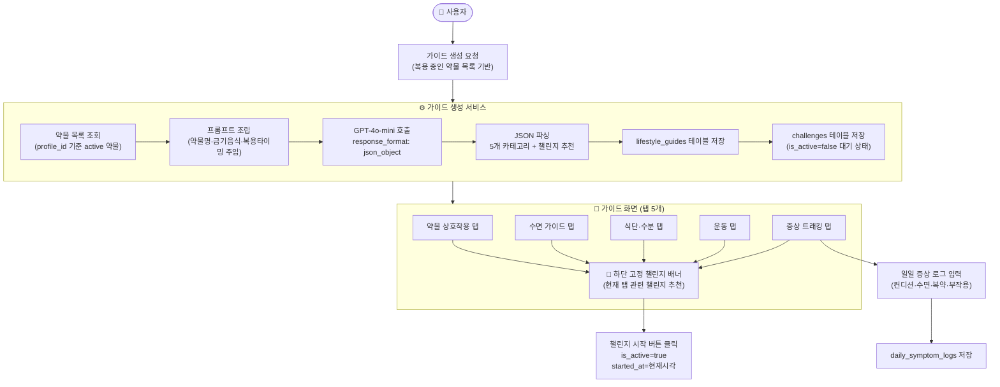

# PLAN: 생활습관 가이드 (Lifestyle Guide) 전체 구현

## 개요

사용자가 복용 중인 약물 데이터를 기반으로 LLM이 5개 카테고리의 맞춤형 생활습관 가이드를 생성하고,
DB에 저장한 뒤 UI로 표시하고, 챌린지로 이어지는 전체 흐름을 구현한다.

---

## 전체 데이터 흐름



---

## ⚠️ 아키텍처 결정 사항

### 1. 기존 Challenge 모델 확장 (확정)

기존 `challenges` 테이블을 확장한다. `guide_id nullable FK` 추가로 LLM 생성 챌린지와 수동 생성 챌린지를 하나의 테이블에서 관리.

| 구분 | LLM 생성 챌린지 | 사용자 수동 챌린지 |
|------|----------------|-----------------|
| `guide_id` | 있음 (lifecycle_guides FK) | null |
| `category` | 5개 카테고리 중 하나 | null 또는 사용자 지정 |
| 생성 위치 | 가이드 생성 시 자동 | 챌린지 탭에서 직접 추가 |
| 삭제 | 가능 | 가능 |

**챌린지 UI 구성 원칙**
- 기본: 가이드 탭 하단에 LLM 추천 챌린지 표시
- 챌린지 탭: LLM 추천 + 사용자 수동 추가 챌린지 통합 관리
- 사용자가 직접 챌린지 추가 / 삭제 가능 (수동 생성 챌린지)
- LLM 추천 챌린지도 사용자가 삭제 가능 (원하지 않는 챌린지 제거)

```
챌린지 탭 구조
├── [LLM 추천] 태그가 붙은 카드 (guide_id 있음)
├── [직접 추가] 태그가 붙은 카드 (guide_id null)
└── "+ 챌린지 추가" 버튼 (수동 생성 모달)
```

### 2. user_id vs profile_id (확정)

요구사항에 `user_id` FK로 명시되어 있으나, 기존 아키텍처는 기능별 데이터를 `profile_id`에 연결한다.

> 결정: **`profile_id` 사용** — 기존 설계 원칙 준수

### 3. 로깅 전략 (확정)

약물 추출부터 챌린지 완료까지 전 구간에 구조화된 로그를 남긴다. 태그 prefix로 필터링 가능하게 설계.

**로그 태그 체계**

| 태그 | 대상 구간 | 예시 |
|------|----------|------|
| `[OCR]` | 처방전 이미지 수신 → 약물 추출 → 저장 | `[OCR] 약물 추출 완료: 3개` |
| `[GUIDE]` | 가이드 생성 요청 → GPT 호출 → 저장 | `[GUIDE] GPT 호출 시작 profile_id=xxx` |
| `[CHALLENGE]` | 챌린지 시작 → 일일 체크 → 완료 | `[CHALLENGE] 챌린지 완료 id=xxx` |
| `[LOG]` | 일일 증상 로그 입력 → 저장 | `[LOG] 증상 로그 저장 date=2026-04-22` |

**로깅 구현 규칙**
```python
# 각 구간별 로그 레벨 기준
logger.info("[OCR] 약물 추출 완료: %d개 profile_id=%s", count, profile_id)
logger.info("[GUIDE] GPT 호출 시작 profile_id=%s", profile_id)
logger.warning("[GUIDE] GPT 응답 파싱 실패 — 재시도 가능")
logger.error("[GUIDE] 가이드 저장 실패 profile_id=%s", profile_id)
logger.info("[CHALLENGE] 챌린지 시작 id=%s profile_id=%s", challenge_id, profile_id)
logger.info("[CHALLENGE] 일일 체크 완료 id=%s date=%s", challenge_id, today)
logger.info("[CHALLENGE] 챌린지 완료 id=%s", challenge_id)
logger.info("[LOG] 증상 로그 저장 profile_id=%s date=%s", profile_id, log_date)
```

> 개인정보(약물명 등) 로그 기록 시 마스킹 필수 — 약물명은 개수만 기록, ID는 허용

---

## DB 스키마 설계

### 신규 테이블 1: `lifestyle_guides`

```python
class LifestyleGuide(models.Model):
    id = fields.UUIDField(pk=True)
    profile = fields.ForeignKeyField("models.Profile", related_name="lifestyle_guides")

    # 5개 카테고리 JSONB 컬럼
    medication_interaction = fields.JSONField()   # 약물-생활습관 상호작용
    sleep_circadian       = fields.JSONField()   # 생체 리듬·수면
    diet_hydration        = fields.JSONField()   # 식단·수분
    exercise_activity     = fields.JSONField()   # 운동·신체활동
    symptom_tracking      = fields.JSONField()   # 증상 트래킹

    # 생성 당시 약물 스냅샷 + LLM 원문 응답
    medication_snapshot = fields.JSONField()
    raw_llm_response    = fields.TextField()

    created_at = fields.DatetimeField(auto_now_add=True)

    class Meta:
        table = "lifestyle_guides"
```

### 신규 테이블 2: `daily_symptom_logs`

```python
class DailySymptomLog(models.Model):
    id = fields.UUIDField(pk=True)
    profile = fields.ForeignKeyField("models.Profile", related_name="symptom_logs")
    guide   = fields.ForeignKeyField("models.LifestyleGuide", related_name="symptom_logs")

    log_date         = fields.DateField()
    condition_score  = fields.IntField()          # 1~10
    sleep_hours      = fields.FloatField(null=True)
    medication_taken = fields.BooleanField(default=False)
    side_effects     = fields.JSONField(default=list)  # 부작용 목록 배열
    memo             = fields.TextField(null=True)

    created_at = fields.DatetimeField(auto_now_add=True)
    updated_at = fields.DatetimeField(auto_now=True)

    class Meta:
        table = "daily_symptom_logs"
        unique_together = (("profile_id", "log_date"),)  # 같은 날 중복 불가
```

### 기존 테이블 수정: `challenges`

```python
# 기존 Challenge 모델에 아래 컬럼 추가
guide       = fields.ForeignKeyField("models.LifestyleGuide", null=True, related_name="challenges")
category    = fields.CharField(max_length=64, null=True)   # 해당 카테고리
is_active   = fields.BooleanField(default=False)           # 시작 여부
started_at  = fields.DatetimeField(null=True)              # 시작 시각
completed_at = fields.DatetimeField(null=True)             # 완료 시각
```

---

## LLM 프롬프트 설계

### 시스템 프롬프트 구조

```
당신은 복약 전문 생활습관 코치입니다.
아래 약물 목록을 참고하여 5개 카테고리의 맞춤형 생활습관 가이드를 JSON으로 반환하세요.

[약물 목록]
{medications_list}
```

### 응답 JSON 스키마

```json
{
  "medication_interaction": {
    "forbidden_foods": [
      {"food": "자몽", "related_drug": "약품명", "reason": "이유", "risk_level": "high"}
    ],
    "photosensitivity": {"warning": true, "guide": "외출 시 선크림 필수"},
    "alcohol_warning": {"warning": true, "message": "경고 메시지"},
    "tips": ["실천 팁 1", "실천 팁 2"]
  },
  "sleep_circadian": {
    "optimal_timing": [{"drug": "약품명", "time": "아침 식후", "reason": "이유"}],
    "morning_routine": {"needed": true, "steps": ["단계1", "단계2"]},
    "tips": []
  },
  "diet_hydration": {
    "water_intake": {"amount_ml": 2000, "restricted": false, "guide": "가이드 문구"},
    "nutrients": [{"name": "비타민K", "type": "restrict", "reason": "이유"}],
    "meal_order": {"recommended": true, "reason": "이유"},
    "tips": []
  },
  "exercise_activity": {
    "recommended": [{"name": "걷기", "reason": "이유"}],
    "restricted": [{"name": "격렬한 운동", "related_drug": "약품명", "reason": "이유"}],
    "stretching": [{"area": "허리", "duration_min": 5}],
    "tips": []
  },
  "symptom_tracking": {
    "side_effect_checklist": [
      {"symptom": "어지러움", "related_drug": "약품명", "action": "대처방법"}
    ],
    "daily_log_items": ["컨디션 점수(1~10)", "수면 시간", "복약 여부", "특이사항"],
    "tips": []
  },
  "recommended_challenges": [
    {
      "category": "sleep_circadian",
      "title": "챌린지 제목",
      "description": "설명",
      "target_days": 7,
      "difficulty": "easy"
    }
  ]
}
```

---

## API 엔드포인트 설계

| 메서드 | 경로 | 설명 |
|--------|------|------|
| POST | `/api/v1/lifestyle-guides/generate` | LLM 호출 및 가이드 생성 |
| GET | `/api/v1/lifestyle-guides/latest` | 프로필 최신 가이드 조회 |
| GET | `/api/v1/lifestyle-guides` | 프로필 가이드 목록 조회 (히스토리용) |
| GET | `/api/v1/lifestyle-guides/{guide_id}` | 특정 가이드 상세 조회 |
| GET | `/api/v1/lifestyle-guides/{guide_id}/challenges` | 가이드별 챌린지 목록 |
| PATCH | `/api/v1/challenges/{id}/start` | 챌린지 시작 (is_active=true) |
| POST | `/api/v1/daily-logs` | 일일 증상 로그 저장 |
| GET | `/api/v1/daily-logs?days=30` | 최근 N일 로그 조회 |

> 기존 아키텍처 패턴 준수: Router → Service → Repository

---

## 서비스 로직 (`LifestyleGuideService`)

```python
async def generate_guide(self, profile_id: UUID) -> LifestyleGuide:
    # 1. active 약물 목록 조회
    medications = await self.medication_repo.get_active(profile_id)

    # 2. 프롬프트 조립
    prompt = self.prompt_builder.build(medications)

    # 3. GPT-4o-mini 호출
    raw_response = await self.llm_client.call(prompt, response_format="json_object")

    # 4. JSON 파싱 및 검증
    parsed = GuideResponseSchema.model_validate_json(raw_response)

    # 5. lifestyle_guides 저장
    guide = await self.guide_repo.create(profile_id, parsed, raw_response, medications)

    # 6. 챌린지 추천 저장 (is_active=false)
    await self.challenge_repo.bulk_create_from_guide(guide.id, profile_id, parsed.recommended_challenges)

    return guide
```

---

## 챌린지 설계 원칙 (Best Practice)

### 핵심 원칙: 약물과 챌린지의 직접 연결

챌린지가 **왜 이 약을 먹는 사람에게 필요한지** 명확히 표시해야 설득력이 생긴다.

```
예) 혈압약 복용 중
→ "매일 아침 혈압 측정하기"          (Symptom Tracking)
→ "나트륨 2000mg 이하 식단 7일"      (Diet & Hydration)
→ "30분 걷기 5일 연속"               (Exercise & Activity)
   └─ "이 약은 격렬한 운동 시 어지러움 유발 가능 — 저강도 권장"
```

### 챌린지 데이터 구조 (LLM 생성)

```json
{
  "category": "exercise_activity",
  "title": "저강도 걷기 5일 연속",
  "description": "설명",
  "related_drug": "암로디핀",
  "daily_action": "오늘 30분 걷기 완료",
  "target_days": 7,
  "difficulty": "easy"
}
```

> `related_drug` 필드 추가 — 어떤 약물 때문에 이 챌린지인지 UI에 표시

### 챌린지 진행 방식

| 방식 | 설명 |
|------|------|
| 일일 체크인 | 오늘 완료 여부 버튼 하나로 기록 |
| 스트릭 | 연속 달성일 표시 (동기부여) |
| 증상 연동 | Symptom Tracking 카테고리는 daily_symptom_logs와 자동 연결 |
| 약물 변경 감지 | 새 처방전 등록 시 "가이드 업데이트" 알림 |

### 가이드 진입 흐름 (UX)

```
OCR 처방전 등록 완료
       ↓
"복용 중인 약물 기반 맞춤 가이드를 생성할까요?" (팝업)
       ↓  [사용자가 직접 승인 — GPT 비용 + 의식적 확인]
생성 중... (로딩)
       ↓
5개 탭 가이드 화면
       ↓
각 탭 하단: "이 카테고리 챌린지 시작하기" 버튼
```

> 자동 생성이 아닌 **사용자 직접 트리거** 방식 채택 — GPT 호출 비용 제어 + 가이드를 의식적으로 확인하게 유도

---

## UI 구조

```
/lifestyle-guide
├── 히스토리 날짜 칩 (수평 스크롤)
│   └── [4/22 최신] [3/15] [2/01] [1/10] →
│       ├── 선택된 날짜 기준으로 가이드 전환
│       └── 최신이 아닌 경우 "이 가이드는 과거 처방 기준입니다" 배너 표시
├── 탭 네비게이션 (5개)
│   ├── 약물 상호작용 (Medication-Lifestyle Interaction)
│   │   ├── 금기 음식 리스트 (위험도 뱃지: 빨강/노랑/회색)
│   │   ├── 광과민성 배너 (조건부)
│   │   └── 음주 경고 배너 (조건부)
│   ├── 수면·생체리듬 (Circadian Rhythm & Sleep)
│   │   ├── 복용 타이밍 표 (약물별 최적 시간)
│   │   └── 모닝 루틴 아코디언
│   ├── 식단·수분 (Diet & Hydration)
│   │   ├── 수분 섭취 가이드
│   │   ├── 영양소 목록 (제한/권장)
│   │   └── 식사 순서 시각화
│   ├── 운동 (Exercise & Activity)
│   │   ├── 권장 운동 목록 (관련 약물 태그)
│   │   ├── 제한 활동 목록 (주의 아이콘 + 관련 약물)
│   │   └── 스트레칭 루틴
│   └── 증상 트래킹 (Symptom Tracking)
│       ├── 부작용 체크리스트 (약물별)
│       └── 일일 컨디션 입력 폼 → daily_symptom_logs 저장
└── 하단 고정 챌린지 배너
    └── 현재 탭 관련 챌린지 1개
        ├── 관련 약물 표시 ("○○약 복용자 전용")
        ├── 오늘의 할 일 (daily_action)
        └── "챌린지 시작하기" 버튼
```

---

## 엣지 케이스 & UX 상태 정의

### 1. 가이드 생성 실패 처리

```
GPT 호출 실패 원인:
  - 네트워크 오류
  - GPT API 타임아웃 (30초+)
  - JSON 파싱 실패 (응답 형식 오류)
  - 복용 중인 약물 없음 (생성 불가)
```

| 실패 원인 | 사용자에게 보여줄 메시지 | 처리 방식 |
|----------|------------------------|---------|
| 복용 중인 약물 없음 | "복용 중인 약물이 없어 가이드를 생성할 수 없습니다" | 생성 버튼 비활성화 |
| GPT 타임아웃 / 네트워크 오류 | "가이드 생성에 실패했습니다. 잠시 후 다시 시도해주세요" | toast 에러 + 재시도 버튼 |
| JSON 파싱 실패 | 위와 동일 (내부 오류 노출 금지) | 서버에서 500 반환, 클라이언트는 일반 오류 메시지 |

> DB에 부분 저장된 데이터가 없도록 트랜잭션으로 묶어서 처리 (실패 시 롤백)

---

### 2. 챌린지 버튼 상태 정의

하단 고정 챌린지 배너의 버튼은 3가지 상태를 가진다.

| 상태 | 버튼 | 설명 |
|------|------|------|
| 시작 전 (`is_active=false`) | "챌린지 시작하기" | 클릭 시 `is_active=true`, `started_at` 기록 |
| 진행 중 (`is_active=true`, 미완료) | "오늘 완료 체크" | 클릭 시 `completed_dates`에 오늘 날짜 추가 |
| 완료 (`challenge_status=COMPLETED`) | 버튼 없음 + "완료" 뱃지 | 재시작 불가, 완료 상태만 표시 |

> 과거 가이드(히스토리)를 열람 중일 때는 챌린지 배너 버튼 전체 비활성화 — 과거 가이드로 새 챌린지 시작 방지

---

### 3. 로딩 상태 처리

| 상황 | 처리 방식 |
|------|---------|
| 가이드 생성 중 (GPT 호출) | 전체 화면 스켈레톤 + "맞춤 가이드를 생성하고 있어요..." 문구 |
| 가이드 데이터 조회 중 | 탭 콘텐츠 영역 스켈레톤 (카드 3~4개) |
| 날짜 칩 클릭 후 전환 중 | 탭 콘텐츠 영역만 스켈레톤 (날짜 칩은 유지) |
| 증상 로그 저장 중 | 폼 제출 버튼 비활성화 + "저장 중..." 텍스트 |
| 챌린지 시작/체크 중 | 버튼 비활성화 + "처리중..." 텍스트 |

> GPT 호출은 10~30초 소요될 수 있으므로 단순 스피너보다 스켈레톤 + 안내 문구 조합 권장

---

## 개발 순서 (3-Step Cycle)

### Step 0 — 브랜치 생성
```bash
git checkout -b feature/lifestyle-guide-llm-refactor
```

### Step 1 — DB 마이그레이션 (Tidy → Test → Implement)

| 단계 | 작업 |
|------|------|
| Tidy | 기존 Challenge 모델 임포트 정리 |
| Test | 마이그레이션 적용 후 테이블 존재 여부 확인 |
| Implement | `lifestyle_guides`, `daily_symptom_logs` 신규 생성 / `challenges` 컬럼 추가 마이그레이션 |

### Step 2 — 프롬프트 빌더 + LLM 서비스 (Tidy → Test → Implement)

| 단계 | 작업 |
|------|------|
| Tidy | `ai_worker/` 디렉토리 구조 정리 |
| Test | `test_prompt_builder.py` — mock 약물 데이터로 프롬프트 문자열 검증 |
| Implement | `PromptBuilder` 클래스, `GuideResponseSchema` Pydantic 모델 |

### Step 3 — 가이드 생성 서비스 (Tidy → Test → Implement)

| 단계 | 작업 |
|------|------|
| Tidy | Repository 계층 인터페이스 정리 |
| Test | `test_lifestyle_guide_service.py` — LLM mock으로 저장 흐름 검증 |
| Implement | `LifestyleGuideService.generate_guide()` 구현 |

### Step 4 — API 엔드포인트 (Tidy → Test → Implement)

| 단계 | 작업 |
|------|------|
| Tidy | Router 파일 임포트 정리 |
| Test | `test_lifestyle_guide_router.py` — 6개 엔드포인트 응답 코드 검증 |
| Implement | 6개 엔드포인트 구현 |

### Step 5 — UI 구현

| 단계 | 작업 |
|------|------|
| Tidy | 기존 medication 페이지 컴포넌트 분리 패턴 확인 |
| Implement | 탭 5개 컴포넌트, 챌린지 배너, 일일 로그 폼 |

---

## 완료 기준 체크리스트

### 백엔드
- [ ] 브랜치 생성 (`feat/lifestyle-guide`)
- [ ] `lifestyle_guides` 마이그레이션
- [ ] `daily_symptom_logs` 마이그레이션
- [ ] `challenges` 테이블 컬럼 추가 마이그레이션 (guide_id, category, is_active, started_at, completed_at)
- [ ] `PromptBuilder` 구현 + 단위 테스트
- [ ] `GuideResponseSchema` Pydantic 검증 모델
- [ ] `LifestyleGuideService.generate_guide()` 구현 + 단위 테스트
- [ ] 8개 API 엔드포인트 구현
- [ ] `[OCR]` / `[GUIDE]` / `[CHALLENGE]` / `[LOG]` 태그 로깅 전 구간 적용

### 프론트엔드
- [ ] 히스토리 날짜 칩 (수평 스크롤, 가이드 전환)
- [ ] 과거 가이드 열람 시 "과거 처방 기준" 배너 표시
- [ ] 탭 5개 UI 컴포넌트 구현
- [ ] 위험도 뱃지 (high=빨강, medium=노랑, low=회색)
- [ ] 조건부 배너 (광과민성, 음주 경고)
- [ ] 부작용 체크리스트 인터랙션
- [ ] 일일 로그 입력 폼 → API 연동
- [ ] 챌린지 3단계 버튼 상태 (시작하기 / 오늘 완료 체크 / 완료 뱃지)
- [ ] 과거 가이드 열람 시 챌린지 배너 비활성화
- [ ] 챌린지 시작 버튼 → PATCH API 연동
- [ ] [LLM 추천] / [직접 추가] 태그 구분 표시
- [ ] "+ 챌린지 추가" 수동 생성 모달
- [ ] 챌린지 삭제 (LLM 추천 / 수동 모두)
- [ ] 가이드 생성 실패 에러 처리 (재시도 버튼)
- [ ] 복용 약물 없을 때 생성 버튼 비활성화
- [ ] GPT 호출 중 전체 화면 스켈레톤 + 안내 문구
- [ ] 가이드 조회 / 날짜 전환 시 콘텐츠 영역 스켈레톤
- [ ] 증상 로그 저장 중 버튼 비활성화

---

## 영향 범위

| 파일 | 변경 유형 |
|------|----------|
| `app/models/lifestyle_guide.py` | 신규 생성 |
| `app/models/daily_symptom_log.py` | 신규 생성 |
| `app/models/challenge.py` | 수정 (guide_id, is_active, started_at, completed_at 추가) |
| `app/services/lifestyle_guide_service.py` | 신규 생성 |
| `app/repositories/lifestyle_guide_repo.py` | 신규 생성 |
| `app/repositories/daily_log_repo.py` | 신규 생성 |
| `app/apis/v1/lifestyle_guide_routers.py` | 신규 생성 |
| `app/schemas/lifestyle_guide_schemas.py` | 신규 생성 |
| `ai_worker/utils/prompt_builder.py` | 신규 생성 |
| `migrations/models/XXX_lifestyle_guide.py` | 신규 생성 |
| `migrations/models/XXX_daily_symptom_log.py` | 신규 생성 |
| `migrations/models/XXX_challenge_add_guide.py` | 신규 생성 |
| `tests/test_prompt_builder.py` | 신규 생성 |
| `tests/test_lifestyle_guide_service.py` | 신규 생성 |
| `medication-frontend/src/app/lifestyle-guide/` | 신규 생성 |

---

## 향후 기능 (Future Scope)

> 1차 구현 이후 여건이 되면 추가 고려할 기능들. 지금 당장 구현하지 않아도 됨.

### F1. 가이드 PDF 저장 / 링크 공유

**PDF 저장**
- 브라우저 `window.print()` 활용 (별도 라이브러리 불필요) — 인쇄 미리보기로 PDF 저장
- 또는 `react-pdf` / `html2canvas + jsPDF` 조합으로 직접 생성

**링크 공유**
- 백엔드에서 공개 토큰 발급: `GET /api/v1/lifestyle-guides/{guide_id}/share` → `share_token` 반환
- 공개 URL: `/lifestyle-guide/shared/{share_token}` — 로그인 없이 열람 가능 (읽기 전용)
- 토큰 만료 기간 설정 권장 (예: 7일)

```
구현 시 고려사항:
  - 공유 페이지에서는 챌린지 시작 / 증상 로그 입력 버튼 숨김
  - 민감 정보(약물명) 공유 동의 안내 필요
```

---

### F2. 약물 변경 자동 감지 시스템

처방전이 새로 등록되거나 약물이 추가/삭제될 때 기존 가이드가 유효하지 않을 수 있음을 자동으로 감지.

**감지 시점**
- OCR 처방전 등록 완료 시
- 약물 수동 추가 / 삭제 시

**처리 흐름**
```
약물 변경 이벤트 발생
       ↓
최신 가이드의 medication_snapshot 과 현재 약물 목록 비교
       ↓
변경 있음 → 가이드 상단에 배너 표시
  "복용 약물이 변경되었습니다. 가이드를 새로 생성하시겠습니까?" [생성하기]
       ↓
사용자가 수락 → 새 가이드 생성 (기존 가이드는 히스토리로 보존)
```

**비교 로직 (백엔드)**
```python
def has_medication_changed(snapshot: list[dict], current: list[dict]) -> bool:
    snapshot_ids = {m["id"] for m in snapshot}
    current_ids  = {m.id for m in current}
    return snapshot_ids != current_ids
```

> 자동으로 새 가이드를 생성하지 않고 반드시 사용자가 직접 승인하도록 — GPT 비용 제어

---

