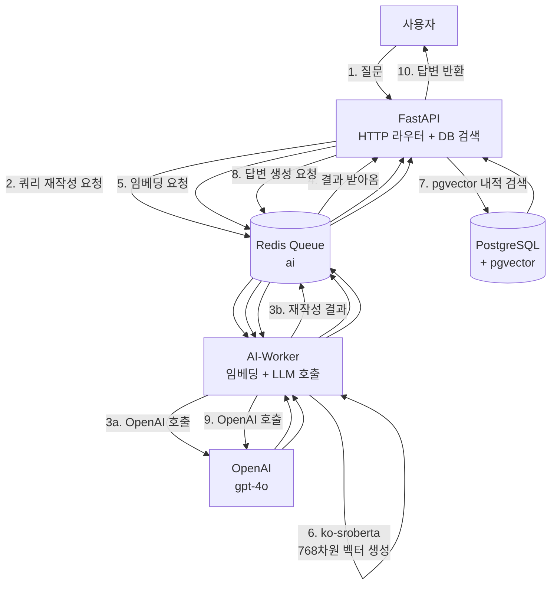
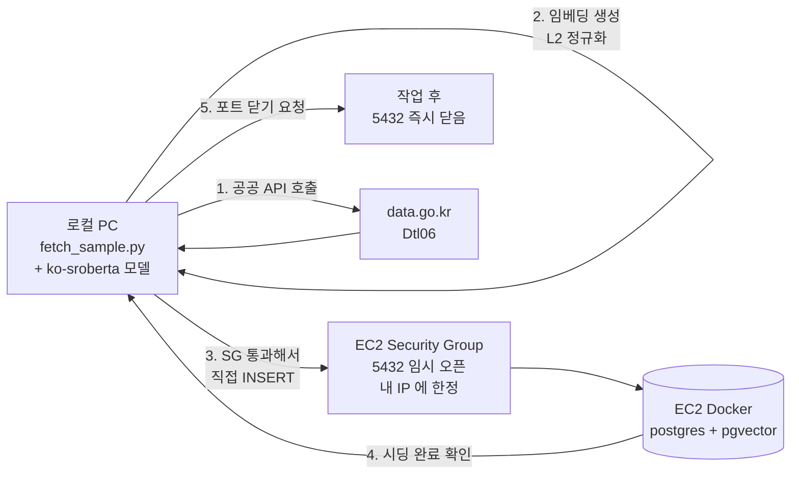
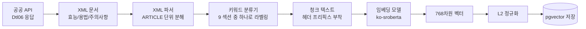
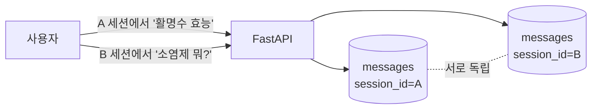
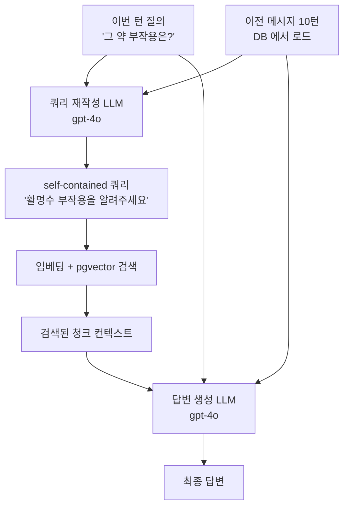
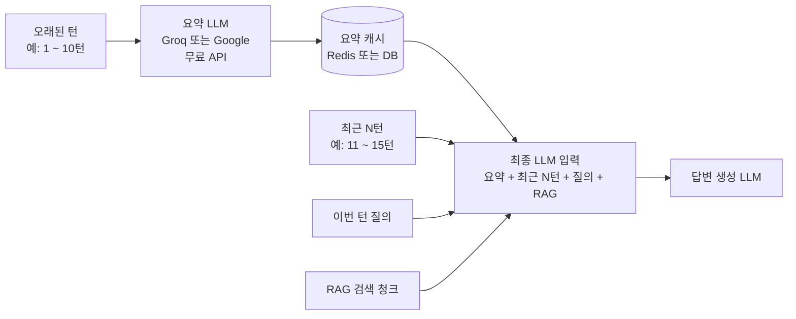

# 시스템 구조 개요 (Phase X 기준)

> 2026-04-23, Phase X (RAG 임베딩·LLM 을 AI-Worker RQ job 으로 이전) 완료 후의
> 시스템 전반을 정리한 문서이다. 기술 용어는 첫 등장 시 간단한 풀이를 괄호로
> 병기한다.

---

## 목차

1. [RAG 파이프라인](#1-rag-파이프라인)
2. [배포환경 메모리 관리](#2-배포환경-메모리-관리)
3. [초기 임베딩 주입 방식](#3-초기-임베딩-주입-방식)
4. [청킹 방식](#4-청킹-방식)
5. [의도분류기 개선 방향](#5-의도분류기-개선-방향)
6. [멀티턴 대화 설계](#6-멀티턴-대화-설계)
7. [향후 작업](#7-향후-작업)

---

## 1. RAG 파이프라인

**RAG** (Retrieval-Augmented Generation · 검색해서 답변을 만들어내는 방식) 는
사용자의 질문에 관련된 약품 정보를 DB 에서 먼저 찾아오고, 그 정보를 근거로
LLM (Large Language Model · 대화형 AI) 이 답변을 생성하는 구조이다.

### 1.1 전체 요청 흐름

사용자가 "활명수 효능 알려줘" 라고 묻는 한 번의 턴이 아래처럼 흐른다.



### 1.2 핵심 설계 포인트

- **FastAPI 는 ML 모델을 들고 있지 않다.** 모든 모델 연산(임베딩·LLM 호출)은
  Redis Queue 를 통해 AI-Worker 로 위임한다. FastAPI 는 I/O, 라우팅, DB 접속,
  pgvector 내적 검색만 담당한다.
- **AI-Worker 는 단일 프로세스에 모델을 상주**시킨다. `ko-sroberta-multitask`
  (한국어 임베딩 모델, ~420MB) 가 프로세스 부팅 시 한 번 로드되고, 이후 들어오는
  모든 job 이 이 인스턴스를 공유한다.
- **RQ** (Redis Queue · 레디스로 메시지 주고받는 작업 큐) 의 `SimpleWorker` 를
  사용한다. 기본 `Worker` 는 매 job 마다 자식 프로세스를 fork 하는데, PyTorch 와
  fork 조합은 deadlock (서로 대기하다 멈춤) 을 일으켜 쓸 수 없다.
- **벡터 정규화 + 내적 사용 여부**: 현재 ko-sroberta 가 반환한 768차원 벡터를
  L2 정규화 (벡터의 길이를 1 로 맞추는 작업) 후 저장·검색한다. pgvector 는
  정규화된 벡터끼리의 내적이 곧 cosine similarity 이므로 L2 정규화된 상태에서는
  내적 기반 top-k 검색이 정확도·속도 모두 최적이다. (현재 코드 확인 완료 —
  `ai_worker/providers/embedding.py::_normalize` 에서 수행)

### 1.3 한 턴의 실측 소요 시간 (Phase X 검증 결과)

| 단계 | 소요 |
| --- | --- |
| 쿼리 재작성 (OpenAI) | 약 4.6초 |
| 임베딩 생성 (ko-sroberta, warmup 상태) | 약 0.17초 |
| 답변 생성 (OpenAI) | 약 2.6초 |
| **총 응답** | **약 8.6초** |

---

## 2. 배포환경 메모리 관리

Phase X 이후 FastAPI 는 ML 상주를 하지 않으므로 메모리 배분이 뒤바뀌었다.
EC2 `t3.medium` (4GB RAM) 기준으로 계산된 배치이다.

### 2.1 컨테이너별 할당

| 컨테이너 | 용도 | limits | reservations | 근거 |
| --- | --- | --- | --- | --- |
| fastapi | HTTP 라우팅, 인증, DB 접근 | **400M** | 128M | Python 3.13 + FastAPI + Tortoise ORM + Redis 클라이언트. ML 완전 제거. |
| ai-worker | ko-sroberta + AsyncOpenAI + ThreadPool | **1500M** | 512M | 모델 420MB + PyTorch CPU 런타임 + 임베딩 버퍼 + 여유. 피크에 ~1.2GB 관찰. |
| postgres (pgvector) | 영속 데이터 + 벡터 인덱스 | 256M | 128M | 샘플 규모 307 chunks 기준 충분. |
| redis | 큐 브로커 + 세션 캐시 | 128M | 64M | RQ 큐 + 소량 캐시. |
| nginx | 리버스 프록시 | 64M | 32M | static 서빙 + proxy_pass. |
| **합계 (limits)** | — | **2.35GB** | — | 4GB 에서 OS + Docker 오버헤드 1GB 감안해도 0.6GB 여유. |

### 2.2 로컬 개발과의 차이

로컬 `docker-compose.yml` 은 여유롭게 잡혀 있다 (fastapi 512M, ai-worker 2G).
개발 중 동시에 빌드·테스트가 돌 수 있기 때문이다. 프로덕션 `docker-compose.prod.yml`
은 EC2 인스턴스 RAM 예산에 맞춰 타이트하게 조정돼 있다.

### 2.3 주의사항

- **ai-worker 의 `start_period` 는 90초** 로 잡혀 있다. 컨테이너 부팅 후 모델
  warmup (첫 encode 준비) 에 약 6초 걸리고, 그 이후 RQ 워커가 기동되므로 그 전에
  Healthcheck 가 돌면 unhealthy 처리된다. 90초 는 여유 있는 값이다.
- **FastAPI 가 OOM (Out-Of-Memory · 메모리 부족으로 강제 종료) 되면** 거의 확실히
  무언가가 잘못 import 된 것이다 (예: 실수로 `sentence_transformers` 직접 import).
  Phase X 후에는 FastAPI 에서 `torch`/`sentence_transformers`/`openai` 의 직접
  import 가 금지된다.

---

## 3. 초기 임베딩 주입 방식

EC2 에 DB 를 처음 올리면 `medicine_info` 와 `medicine_chunk` 가 모두 비어있다.
이 상태에서 초기 307 청크를 채우는 방식이다.

### 3.1 전략: "EC2 DB 포트 임시 오픈 → 로컬 PC 에서 직접 시딩"

- EC2 AI-Worker 에 처음부터 fetch_sample.py 를 돌리게 하지 않는다. 배포 초기엔
  메모리와 네트워크가 불안정하고, 실패 시 복구가 번거롭다.
- 대신 EC2 postgres 의 **5432 포트를 제한된 시간 동안 로컬 PC IP 에 한해 개방**
  하고, 로컬 PC 에서 `fetch_sample.py` 를 실행한다. 로컬 PC 의 파이썬 + ko-sroberta
  가 임베딩을 만들어 EC2 DB 에 직접 INSERT 한다.
- 작업이 끝나면 EC2 Security Group (AWS 방화벽) 에서 5432 포트를 다시 닫는다.

### 3.2 흐름도



### 3.3 왜 이렇게 하는가

- **EC2 에 ML 부하 집중을 피한다**: 초기 시딩은 수십 번의 API 호출 + 307 번의
  encode 가 필요해 기동 중인 EC2 에 큰 부담을 준다. 로컬 PC 가 대신 짐을 진다.
- **디버깅이 쉽다**: 실패하면 로컬에서 재시도하면 된다. 원격 환경 변수·네트워크
  이슈 배제.
- **보안 경계가 명확하다**: 포트는 작업 시간 동안만 열리고, 내 IP 에만 열린다.
  배포 후에는 오직 AI-Worker 만 내부 네트워크로 postgres 에 접근한다.

### 3.4 명령 예시 (순서)

```bash
# 1) EC2 Security Group 5432 임시 허용 (내 IP)
aws ec2 authorize-security-group-ingress --group-id sg-xxx \
  --protocol tcp --port 5432 --cidr $(curl -s https://checkip.amazonaws.com)/32

# 2) 로컬 .env 에 DB_HOST 를 EC2 도메인/IP 로 변경
# DB_HOST=ec2-xxx.compute.amazonaws.com

# 3) 로컬 컨테이너에서 시딩
docker exec fastapi uv run --no-sync python -m scripts.crawling.fetch_sample --limit 50

# 4) 포트 닫기
aws ec2 revoke-security-group-ingress --group-id sg-xxx \
  --protocol tcp --port 5432 --cidr $(curl -s https://checkip.amazonaws.com)/32
```

실 운영에서는 (3) 이 끝나면 (2) 의 DB_HOST 설정을 원복하는 것도 잊지 말아야 한다.

---

## 4. 청킹 방식

**청크 (chunk · 텍스트 조각)** 는 검색 단위이다. 약품 한 건의 설명을 섹션별로
자르고 각각을 768차원 벡터로 바꿔 pgvector 에 저장한다.

### 4.1 청크 생성 흐름



### 4.2 섹션 13종

하나의 약품은 아래 섹션들 중 실제로 내용이 있는 것만 청크로 생성된다.

- `EFFICACY` — 효능
- `USAGE` — 용법·용량
- `STORAGE` — 보관법
- `INGREDIENT` — 주성분
- `PRECAUTION_WARNING` — 경고
- `PRECAUTION_CONTRAINDICATION` — 금기
- `PRECAUTION_CAUTION` — 신중 투여
- `PRECAUTION_PREGNANCY` — 임부·수유부 주의
- `PRECAUTION_PEDIATRIC` — 소아 주의
- `PRECAUTION_ELDERLY` — 고령자 주의
- `PRECAUTION_OVERDOSE` — 과량투여 처치
- `ADVERSE_REACTION` — 이상반응·부작용
- `PRECAUTION_GENERAL` — 기타 일반 주의 (분류기에 걸리지 않은 ARTICLE 의 폴백)

### 4.3 청크 본문 예시

임베딩 직전의 실제 텍스트는 아래 형태이다 (섹션 헤더를 앞에 붙여 벡터가 약품
식별 + 섹션 카테고리를 함께 담도록 한다).

```
[활명수] 효능
식욕감퇴(식욕부진), 위부팽만감, 소화불량, 과식, 체함, 구역, 구토
```

### 4.4 현재 샘플 규모

- medicine_info 27 건 × 평균 11 청크 = **307 청크** (Phase X 검증 시점)
- 13 섹션 전부 최소 1 건 이상 채워져 있음

---

## 5. 의도분류기 개선 방향

### 5.1 현재 구현

FastAPI 의 `IntentClassifier` 는 **키워드 기반 규칙 분류기** 이다. 사용자 쿼리에
등장하는 단어로 의도를 결정한다. 예:

- `"활명수"` + `"효능"` → `medication_info`
- `"날씨"` → `weather`
- `"안녕"` → `greeting`
- 아무 키워드도 안 걸리면 → `out_of_scope`

### 5.2 검증 결과 (UI 시나리오 A~J)

실제 UI 에서 10건의 시나리오로 돌린 결과는 아래와 같다.

| # | 시나리오 | 질의 | 결과 |
| --- | --- | --- | --- |
| A | EFFICACY | 활명수 효능 알려줘 | ✅ pass |
| B | EFFICACY 2 | 페니라민정 효능 알려줘 | ✅ pass |
| C | USAGE | 디고신정 용법 알려줘 | ✅ pass |
| D | PRECAUTION_WARNING | 테라싸이클린 경고사항 알려줘 | ❌ fail (out_of_scope) |
| E | PRECAUTION_PREGNANCY | 다이크로짇정 임부 사용 가능해? | ❌ fail (out_of_scope) |
| F | PRECAUTION_PEDIATRIC | 페니라민정 소아 복용 주의사항 | ✅ pass |
| G | ADVERSE_REACTION | 활명수 부작용 알려줘 | ✅ pass |
| H | STORAGE | 삐콤정 보관법 어떻게 해? | ❌ fail (out_of_scope) |
| I | UNRESOLVABLE | 타이레놀 복용법 알려줘 | ⚠ partial (DB 외 약품인데 유사도 0.38 로 오탐 + LLM 세계지식으로 답변) |
| J | OUT_OF_SCOPE | 오늘 날씨 어때 | ✅ pass |

**요약**: 6 pass / 1 partial / 3 fail.

### 5.3 한계 분석

Fail 3 건 (D, E, H) 은 모두 **같은 원인** 이다.
- 의도 키워드 사전에 `경고사항`, `임부`, `보관법` 이 등록돼 있지 않다.
- 약품명(`테라싸이클린`, `다이크로짇정`, `삐콤정`)도 키워드 사전에 없다.
- 결국 `medication_info` 로 분류되지 못하고 `out_of_scope` 폴백.

Partial 1 건 (I) 은 분류기는 맞췄지만 **RAG 단계가 취약** 하다.
- DB 에 없는 약이라도 유사도 0.38 로 엉뚱한 약이 top-k 에 들어오면 LLM 이 그 청크
  를 완전히 무시하고 세계지식으로 타이레놀을 설명해버린다 (hallucination).

### 5.4 개선 방향

- **단기**: 키워드 사전 확장. `경고`, `임부`, `보관` 등 상위 빈도 단어 추가.
  빠르게 fail 수를 줄일 수 있으나 근본 해결은 아니다.
- **중기**: `medication_info` vs `out_of_scope` 이진 결정만 LLM 에 위임.
  비용이 낮은 작은 모델로 호출.
- **장기 (Phase C 합의됨)**: **OpenAI Function Calling 기반 단일 Router LLM**
  으로 전환. 현재 13 섹션 검색이 `search_medicine_info` 하나의 툴로 축소되고,
  나머지 지식 소스 (복약 기록, DUR, 건강 설문, 날씨 등) 는 각각 별개 툴로 분리.
  이 때 키워드 사전은 완전히 제거된다.
- **Hallucination 대책 (Phase C 병행)**: retrieved top-k 유사도가 임계치 미만
  이면 LLM 에 "근거 없음" 을 명시하고 답변을 거부하게 하는 **citation 기반 답변**
  을 강제. "DB 에 없는 약입니다" 라고 솔직하게 답하도록.

---

## 6. 멀티턴 대화 설계

### 6.1 세션 단위 격리

사용자가 챗 모달에서 "새 대화" 를 누를 때마다 **새 `session_id` (UUID)** 가
발급된다. 모든 메시지는 DB 의 `messages` 테이블에 `session_id` 컬럼으로
묶여 저장된다.



- 같은 사용자라도 세션 A 의 대화 내용이 세션 B 에 새지 않는다.
- 세션 목록은 `chat-sessions` 테이블에서 `account_id` 로 필터링된다. **세션
  소유권 검증** 이 모든 메시지 API 에 적용된다.

### 6.2 같은 세션 내 히스토리 유지

한 턴을 처리할 때 FastAPI 는 해당 `session_id` 의 이전 메시지 전체를 DB 에서
읽어와 LLM 에 함께 넘긴다. 이 히스토리는 두 곳에서 쓰인다.



### 6.3 쿼리 재작성의 역할

사용자는 "**그 약** 부작용은?" 처럼 **대명사** 로 말한다. LLM 이 히스토리를
보고 "그 약 = 활명수" 로 치환해 self-contained 쿼리 "활명수 부작용을
알려주세요" 로 바꾸고, 이 쿼리가 임베딩·검색 단계로 들어간다.
기존 Phase A 구현에서 이미 동작하고 있다.

### 6.4 한계: 히스토리가 길어지면?

현재는 이전 메시지 **전부** 를 LLM 입력에 붙인다. 10턴까지는 문제없지만
30~50턴이 쌓이면:

- OpenAI 토큰 한도 초과 위험
- 오래된 턴에 attention 이 흩어져 실질적 기억 저하
- 호출 비용 증가

### 6.5 개선 방향: 요약 + 최근 N턴 하이브리드



**설계 포인트**:

- **요약 LLM 선택**: 비용 절감을 위해 Groq (매우 빠른 무료 티어) 또는
  Google Gemini 무료 API 후보. OpenAI 가 아닌 외부 제공자 사용.
- **가명처리 필수**: 요약을 외부 API 에 넘길 때 사용자 실명·연락처·주민번호·
  정확한 주소 같은 **고유 식별 정보를 제거** 하고 **profile_id 같은 내부
  식별자로만** 구분해서 보낸다. DB 에 저장될 때도 동일 원칙.
- **캐시 위치**: 요약문은 Redis 또는 DB 에 저장. 매 턴마다 오래된 메시지를
  다시 요약하지 않고 기존 요약 + 신규 몇 턴만 병합.

이 작업은 어제까지의 로드맵에서 **Phase B (세션 요약 캐시)** 로 분류돼 있다.

---

## 7. 향후 작업

Phase X 이후 남은 작업 백로그이다. 우선순위 순.

### 7.1 사용자 쿼리 재작성에서 문장 생성 개선

현재 `rewrite_query_job` 의 프롬프트는 대명사·생략된 주어 치환에 집중한다.
개선 여지:

- **오탈자·띄어쓰기 정상화**: "페니라민 정 효능" → "페니라민정 효능"
- **모호한 증상 질의의 구체화**: "머리 아픈데 뭐 먹어?" → "두통에 효과가 있는
  일반의약품을 알려주세요" 로 확장
- **약품명 표준화**: 사용자가 입력한 약품명을 DB 의 정식 명칭으로 정렬 (fuzzy
  matching 또는 LLM 보조)

이 중 어느 수준까지 갈지는 Phase C 의 Router LLM 설계와 함께 재논의.

### 7.2 이미지 저장 S3 사용

OCR 업로드 이미지를 AWS S3 에 저장. 현재는 FastAPI 컨테이너 파일시스템에
임시 저장되고 있어 EC2 재기동·디스크 용량 측면에서 취약하다.

고려할 점:
- **버킷 분리**: prod / dev 버킷 분리
- **prefix 설계**: `ocr/{account_id}/{session_id}/{timestamp}_{uuid}.{ext}`
- **수명 정책**: OCR 결과 추출 후 원본 이미지는 N일 뒤 자동 삭제 (S3 Lifecycle)
- **AI-Worker 접근**: 현재 OCR 작업은 ai-worker 에서 수행하므로, S3 SDK 를
  ai-worker 이미지에 추가
- **IAM**: EC2 인스턴스 프로파일 또는 액세스 키. 최소권한 원칙 적용
- **프로필 사진도 같은 버킷 쓸지 별개로 갈지** 는 미정 (별 prefix 로 같은 버킷
  공유가 단순)

### 7.3 Phase B — 세션 요약 캐시

6.5 에서 설명한 요약 파이프라인 구현. Groq vs Gemini 선택, 가명처리 유틸리티
작성, Redis 요약 캐시 스키마 설계 포함.

### 7.4 Phase C — Agentic RAG

의도분류기 → Router LLM 전환. `search_medicine_info` 외 멀티 툴 설계
(`get_user_profile`, `check_drug_interactions`, `nearby_pharmacy` 등).

### 7.5 CI/CD 복구 및 EC2 배포

현재 disabled 상태인 `.github/workflows/checks.yml`, `deploy.yml` 복구.
두 이미지 (app, ai) 를 분리 빌드·푸시하고 EC2 에서 compose pull 로 롤링
업데이트.
