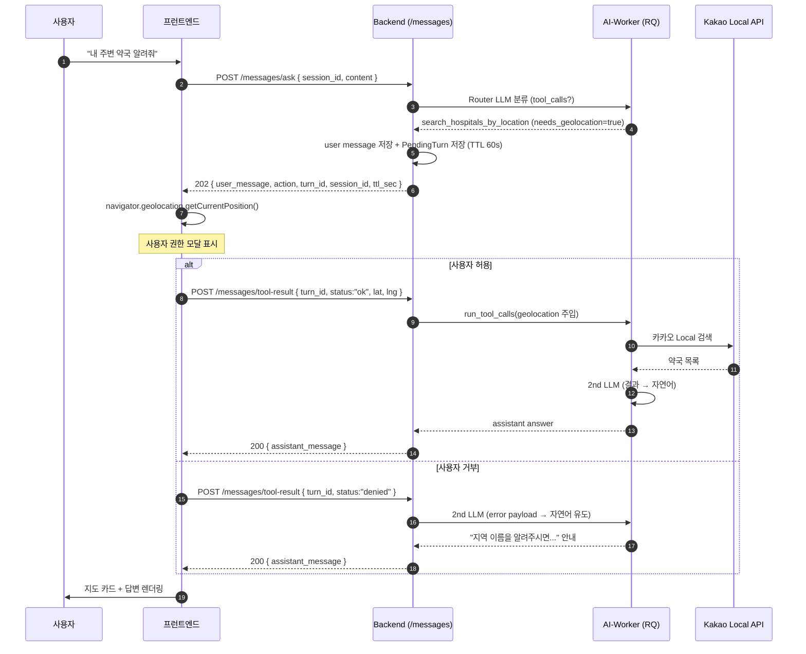

# 툴 콜링 연동 가이드 (Phase Y — 병원/약국 위치 찾기)

> 대상 독자: **프런트엔드 개발자** / 이 문서는 Phase Y (Router LLM 기반 툴 콜링)
> 완료 시점의 API 계약과 FE 가 반드시 처리해야 할 GPS 콜백 플로우를 정리한다.

---

## 0. 한 줄 요약

사용자가 **"내 주변 약국 알려줘"** 라고 말하면 백엔드는 즉시 답을 주지 못한다. 위치를
알아야 하기 때문이다. 그래서 `/messages/ask` 가 **202 Accepted** 를 돌려주고,
프런트가 브라우저의 `navigator.geolocation` 으로 좌표를 받아
**`/messages/tool-result`** 로 다시 찔러줘야 답변이 완성된다.

반면 **"강남역 약국"** 처럼 지명이 포함된 질문은 좌표가 필요 없으므로
`/messages/ask` 한 번에 **200 OK** 로 답이 돌아온다.

---

## 1. 전체 시퀀스 (한눈에)



---

## 2. 엔드포인트 계약

### 2.1 `POST /api/v1/messages/ask`

사용자 질문 한 건을 받는 통합 엔드포인트. **상태 코드로 분기**한다.

#### 요청

```json
{
  "session_id": "b4f3e4c2-1111-2222-3333-444455556666",
  "content": "내 주변 약국 알려줘"
}
```

- Header: `Authorization: Bearer <access_token>` (기존 로그인 플로우 그대로)

#### 응답 — **200 OK** (일반 답변)

Router LLM 이 (a) 자연어로 답했거나 (b) keyword-only 툴만 호출한 경우.

```json
{
  "user_message": { "id": "...", "session_id": "...", "sender_type": "USER",
                    "content": "강남역 약국", "created_at": "...", "deleted_at": null },
  "assistant_message": { "id": "...", "session_id": "...", "sender_type": "ASSISTANT",
                         "content": "가까운 약국은 강남스퀘어약국...", ... }
}
```

#### 응답 — **202 Accepted** (GPS 콜백 필요)

Router LLM 이 `search_hospitals_by_location` 같은 좌표 기반 툴을 요청한 경우.
**user_message 는 이미 DB에 저장된 상태**이고, assistant 답변은 콜백 이후 생성된다.

```json
{
  "user_message": { ... },
  "action": "request_geolocation",
  "turn_id": "a1b2c3d4-...",
  "session_id": "b4f3e4c2-...",
  "ttl_sec": 60
}
```

`action` 은 현재 `"request_geolocation"` 한 종류뿐이지만, 향후 다른 권한
요청이 추가될 수 있으니 **문자열 분기로 라우팅**하는 걸 권장한다.

### 2.2 `POST /api/v1/messages/tool-result`

202 응답을 받은 다음, GPS 콜백 결과를 BE에 전달한다.

#### 요청 (권한 허용)

```json
{
  "turn_id": "a1b2c3d4-...",
  "status": "ok",
  "lat": 37.4978,
  "lng": 127.0286
}
```

#### 요청 (권한 거부)

```json
{
  "turn_id": "a1b2c3d4-...",
  "status": "denied"
}
```

- `status="ok"` 면 `lat`/`lng` 필수. 둘 중 하나라도 빠지면 **400**.
- `status="denied"` 면 좌표 무시.

#### 응답 — **200 OK**

```json
{
  "assistant_message": { "id": "...", "session_id": "...", "sender_type": "ASSISTANT",
                         "content": "미진약국이 가장 가깝습니다...", ... }
}
```

#### 에러

| 상태 코드 | 상황 | FE 대응 |
| --- | --- | --- |
| **400** | `status="ok"` 인데 lat/lng 누락 | 검증 로직 버그. 콘솔 로그 + 사용자에겐 "다시 시도" |
| **403** | 다른 계정의 `turn_id` | 세션 하이재킹 징후. 즉시 로그아웃 유도 |
| **410 Gone** | `turn_id` 만료 (60s 초과) 또는 이미 소비됨 | 사용자에게 "시간이 지났어요, 다시 물어봐주세요" 안내 |

---

## 3. FE 구현 체크리스트

### 3.1 기본 플로우

```typescript
// 1) 질문 전송
const res = await api.post('/api/v1/messages/ask', {
  session_id, content,
})

// 2) 상태 코드로 분기
if (res.status === 200) {
  // 일반 답변 — 바로 렌더링
  renderMessage(res.data.user_message)
  renderMessage(res.data.assistant_message)
  return
}

if (res.status === 202) {
  // GPS 콜백 필요
  renderMessage(res.data.user_message)        // 사용자 턴은 먼저 표시
  showLocationLoadingSpinner()                 // 로딩 UI
  await handleGeolocationCallback(res.data)
  return
}
```

### 3.2 GPS 콜백 핸들러

```typescript
async function handleGeolocationCallback(pending: {
  turn_id: string
  session_id: string
  ttl_sec: number
}) {
  try {
    const position = await new Promise<GeolocationPosition>((resolve, reject) => {
      navigator.geolocation.getCurrentPosition(resolve, reject, {
        // TTL 보다 여유있게: 60s 만료니까 15s 내에 응답받도록 강제
        timeout: 15_000,
        maximumAge: 0,
      })
    })

    const result = await api.post('/api/v1/messages/tool-result', {
      turn_id: pending.turn_id,
      status: 'ok',
      lat: position.coords.latitude,
      lng: position.coords.longitude,
    })
    renderMessage(result.data.assistant_message)
  } catch (err) {
    // 권한 거부 또는 타임아웃
    const result = await api.post('/api/v1/messages/tool-result', {
      turn_id: pending.turn_id,
      status: 'denied',
    })
    renderMessage(result.data.assistant_message)
  } finally {
    hideLocationLoadingSpinner()
  }
}
```

### 3.3 주의할 점

- **TTL 60초**. 사용자가 권한 모달을 오래 끌면 410 이 뜰 수 있다. FE 가 자체 타이머로
  `ttl_sec - 5` 초 경과 시 "다시 시도" 버튼으로 유도하는 게 안전하다.
- **`maximumAge: 0`** 으로 캐시된 좌표 재사용을 막는다. 사용자가 이동 중일 수
  있으므로 매번 신선한 좌표가 낫다.
- **HTTPS 환경에서만 동작**. `navigator.geolocation` 은 비-HTTPS 에서 차단된다
  (localhost 는 예외). 개발 환경에서 확인 시 유의.
- **권한 영속 저장 금지**. 브라우저가 이미 한 번 기억하므로 FE 가 따로
  `localStorage` 에 "지난번 허용했음" 플래그를 두지 않는다. 매 호출마다 브라우저
  기본 정책에 맡긴다.
- **좌표 (0, 0) 금지**. 바다 한가운데라 의미 없는 질의가 된다. BE 가 막긴 하지만
  FE 에서도 0 값 필터링 권장.

---

## 4. UI 컴포넌트 권장안

### 4.1 위치 권한 안내 모달

`/messages/ask` 가 202 를 주고 `navigator.geolocation` 호출 **직전**에 표시.
브라우저 기본 권한 모달이 뜨기 전에 맥락을 설명해 거부율을 낮춘다.

```
┌────────────────────────────────────┐
│  🏥  근처 약국 · 병원 찾기            │
│                                    │
│  정확한 검색을 위해 현재 위치가         │
│  필요합니다. 위치는 검색 요청에만       │
│  사용되며 저장되지 않습니다.           │
│                                    │
│  [ 위치 알려주기 ]   [ 지명으로 입력 ] │
└────────────────────────────────────┘
```

오른쪽 버튼(지명 입력)은 `status="denied"` 로 BE 를 태워도 되고, 아예
`/messages/tool-result` 를 태우지 않고 사용자가 새 질문 ("역삼동 약국") 을
치도록 유도해도 된다.

### 4.2 지도 카드 (assistant_message content 렌더링)

Phase Y 범위에서는 `assistant_message.content` 는 **순수 자연어**만 포함한다.
장소 카드(지도/전화/길찾기 버튼) 를 그리려면 이후 Phase 에서
`metadata.places` 를 추가할 예정이니, 지금은 자연어 그대로 표시하면 된다.

> **Out of scope (Phase Y-9 에서 안 함):** `metadata.places` 구조화, 카카오맵
> SDK 연동, 길찾기 딥링크. Phase Y 후속 작업에서 추가.

### 4.3 로딩 인디케이터

202 수신 ~ 200 수신 사이에 평균 **2-4초** 정도 걸린다
(GPS 권한 응답 + 카카오 API + LLM 2회). 스켈레톤 버블을 assistant 자리에 먼저
렌더링하면 체감 응답 속도가 개선된다.

---

## 5. 디버깅 팁

- 202 받고 `/tool-result` 태우지 않은 채 60초 경과 → Redis 에서 PendingTurn
  만료. 같은 `turn_id` 로 재시도하면 **410**. 해결 : FE 가 사용자에게 질문
  재입력을 유도.
- 401 (Unauthorized) 이 뜨면 Access Token 만료. 기존 토큰 갱신 인터셉터가
  자동 처리해야 한다.
- 422 (Unprocessable Entity) 는 Pydantic 검증 실패. `status` 가 `"ok"` /
  `"denied"` 중 하나가 아니거나 `session_id` 가 UUID 형식이 아닐 때 발생.
- **서버 로그에서** `[ToolCalling] route kind=tool_calls calls=...` 를 확인하면 Router
  LLM 분류가 의도대로 됐는지 디버깅 가능.

---

## 6. 참고

- **백엔드 설계 상세**: `PLAN.md` §0-§11 (Phase Y 전체 설계)
- **서비스 계약 테스트**: `app/tests/test_message_service_tool_branching.py`,
  `app/tests/test_message_service_pending_callback.py`
- **HTTP 통합 테스트**: `app/tests/test_message_routers_tools.py`
- **OpenAPI 스키마**: `/api/docs` 에서 `/messages/ask` · `/messages/tool-result`
  의 200/202/400/403/410 응답 형태 직접 확인 가능
